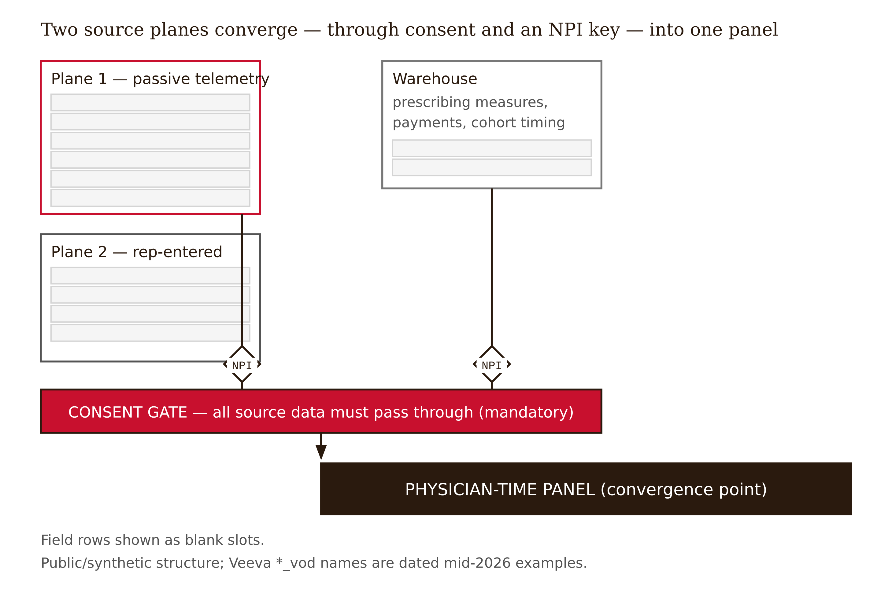

# Chapter 2 — What the Data Actually Is
*Assembly is where causal correctness is won or lost — not at the model.*

A Fellow, eager and competent, builds the first version of the panel. She has session-level telemetry from the iPad, she has prescribing data from the warehouse, she has Open Payments records. She joins them all on physician NPI into one wide table — one row per physician — and starts modeling the effect of the message on prescribing, "controlling for engagement" by including average slide dwell time and the average reaction score as covariates. The regression runs. The coefficients look plausible. She reports a message effect.

The estimate is biased, and the bug is not in the model.

It is in the *assembly*. She folded slide dwell and the per-slide reaction — signals produced during and after the message was delivered — into the same flat row as the message itself, with no time index separating cause from consequence. Then she controlled for them. She conditioned on variables that sit *downstream* of the treatment. We have not yet proven formally why that is fatal — Chapter 6 does it carefully, and these fields are colliders, and conditioning on a collider opens a spurious path — but notice where the damage was done. Not at the modeling step. At the data-assembly step. The panel's time discipline is the thing that protects the estimate. Lose the time index and you have built a trap that no model can climb out of.

This chapter is, at bottom, a lesson in not building that trap.

---

The raw data arrives as event logs: one row per slide view, one row per call, one row per payment. The instinct is to treat the most granular log — the iPad clickstream — as the dataset. That instinct is the first bug.

The clickstream is one table at one grain: slide-view events within a session. It is an ingredient, not the panel. Your estimand — the causal quantity you are actually trying to estimate — is the effect of a message variant on new prescriptions, and that quantity lives at a different grain entirely: **physician-time**, one row per physician per week or per month. Mistaking the log for the dataset is the row-grain error, and it destabilizes every downstream design decision.

So the central conceptual move of this chapter is a unit-of-analysis shift. The causal unit is almost never the click or the slide. It is the physician at a point in time. Building the panel means transforming session rows into analysis rows whose columns carry four ingredients:

- a **treatment** — which message variant was delivered,
- an **outcome** — downstream new prescriptions for that physician, time-lagged so cause precedes effect,
- an **instrument** — the training-cohort timing that will supply the quasi-random variation Chapter 4 exploits,
- **covariates** — pre-treatment characteristics: baseline prescribing, specialty, territory, rep tenure.

The research finding for this chapter, which the assembly will make concrete: all four ingredients are already present in the rep-visit data. The message variant is a real schema object. The outcome is a standard NRx panel join. The instrument is the rollout calendar. The covariates are warehouse fields. Nothing is missing. What has been missing is the assembly discipline and the causal frame. The dataset has been causal-ready for fifteen years.

A useful way to hold this: raw logs are ingredients; the panel is recipe-ready mise en place. You do not cook from the delivery crate. Aggregation, time-indexing, lagging, and joining are the prep work, and they are where causal correctness is won or lost.

---

A standing caveat, stated once and meant throughout the book. Every `*_vod` field name below is a dated mid-2026 example. Veeva is migrating from its Salesforce-based CRM to a proprietary Vault CRM — end-of-support for legacy Veeva CRM is December 2029; Vault CRM is generally available and had 125+ live customers in early 2026.
<!-- FACT-CHECK FLAG: UNVERIFIED — see factchecks/02-what-the-data-actually-is.md (Vault GA April 2024 and legacy EOS Dec 2029 CONFIRMED; the "125+ live customers in early 2026" point-in-time vendor count not independently confirmable) --> The data model is being restructured and API names may be renamed or relocated. Learn the *roles*; verify the *names* against both `crmhelp.veeva.com` and `vaultcrmhelp.veeva.com` before you trust any of them.

---

The CLM schema has two structurally different planes, and the distinction between them is causal, not clerical.

**Plane 1 is passive media-player telemetry** — behavioral and machine-logged, recording what happened without deliberate data entry. While CLM content is presented, the iPad logs a clickstream record; at session end it is packaged and stamped onto activity records. The key fields:

`Duration_vod` is seconds spent on a slide, computed as current time minus start time. A real gotcha that Veeva's own support portal documents: **negative `Duration_vod` values** arise from clock or timezone artifacts. Your cleaning step has to handle them. Telemetry is not pristine, and a chapter that pretended otherwise would be lying to you.

`Display_Order_vod` and `View_Order_vod` capture the sequence of key messages: loops, skips, backtracks through the content. `Display_Order_vod` is a documented field (Veeva CRM Help) representing the configured/displayed order; `View_Order_vod` as a distinct actual-view-sequence field on the activity-line object is `[verify — unconfirmed: searched crmhelp.veeva.com; Display_Order_vod confirmed, but the exact Display_Order_vod-vs-View_Order_vod split was not resolvable in public docs]`.

`Reaction_vod` is the per-slide reaction button — the rep's reading of the physician's reaction to each slide. Verified picklist values: **positive / neutral / negative / none**. Note what this field is: a human label on an ambiguous signal, stamped onto a passive record. A physician who spent 47 seconds on a slide — compelled, skeptical, or just polite — gets a single reaction label from a rep who was simultaneously managing the conversation. That ambiguity is not incidental; it is the whole epistemological problem with using `Reaction_vod` as a control.

`CLM_Presentation_vod` and `Key_Message_vod` are the content objects. A multichannel presentation binder becomes a `CLM_Presentation_vod`; an individual slide becomes a `Key_Message_vod`. These are how a "message variant" is identified in the schema. Your treatment lives here.

`Multichannel_Activity_vod` and `Multichannel_Activity_Line_vod` are the activity header and line objects storing the displayed-slide tracking. (Veeva docs also reference `Multichannel_Line_vod` in the anonymous-tracking topic; whether that is an alias or a distinct object is `[verify]`.)

**Plane 2 is rep-entered post-call data** — interpretive and rep-authored, what the rep thinks happened, entered after the visit on the call report.

`Call2_Key_Message_vod` tracks key messages delivered during the call and carries the per-message reaction. A hard constraint: Veeva states **custom fields on `Call2_Key_Message_vod` are not supported** and will not display on calls. This is a real limit on what can be captured here, and it matters for treatment reconstruction.

Products detailed and priority — which products were discussed, in what order — live on `Call_Detail_vod` lines. Concept verified; exact field API names `[verify]`.

Free-text call notes are the qualitative gold: the objection raised, the colleague mentioned, the formulary issue, the switch signal. This is the "why" the telemetry cannot capture, and it links directly to Chapter 3's epistemic gap. Field exists; exact API name `[verify]`.

---

Here is why two planes is a causal distinction and not a filing system.

Plane 1 is behavioral and passive — machine-logged: *what happened.* Plane 2 is interpretive and rep-authored — *what the rep thinks happened.* And `Reaction_vod` sits in both, which is exactly the 47-second-slide ambiguity. The same duration is consistent with compelled, skeptical, or polite, and the rep's label is a human interpretation on an ambiguous behavioral signal, not ground truth.

Naming which plane a field came from — was this measured or was it interpreted? — is the first discipline before you let any field into a model. But here is where most analyses go wrong: a field's plane and its causal role are independent axes. A passively captured field (`Reaction_vod`) can still be a forbidden control. A human-typed field (`Call2_Key_Message_vod`) can be your treatment. Confusing the two axes is a recurring bug, and it is why the field-role classification table later in this chapter sorts on both dimensions independently.

---

Before Plane-1 data can exist for a physician, consent has to allow it. This matters structurally — it governs whether a physician's row exists at all.

`CLM_EXPLICIT_OPT_IN_vod` is a multichannel setting. If false, accounts are implicitly opted in; if true, an account needs an explicit opt-in consent record or it is treated as opted out. The account-level driver is `Account.CLM_Opt_Type_vod` with values `Never_vod` / `Implicit_Opt_In_vod` / `Explicit_Opt_In_vod`. Verified against Veeva CRM Help.

`CLM_OPT_OUT_BEHAVIOR_vod` defines what happens for opted-out accounts. Setting 0 means no tracking — the session simply vanishes. Setting 1 means anonymous tracking — the activity is written to the activity objects, reactions are saved, but it cannot be associated with an NPI.

A precision correction worth stating: opt-out "strips NPI from the activity record" is right in spirit, but the precise mechanism is `CLM_OPT_OUT_BEHAVIOR_vod` = 1 producing an anonymous write with the NPI-bearing association removed, or = 0 producing no write at all.

The causal consequence — flagged here, developed in Chapter 6: whether a physician's Plane-1 data exists, and whether it carries an NPI, depends on consent. Consent is plausibly correlated with both treatment-side factors (engaged reps, high-contact physicians) and outcome-side factors (prescribing propensity, industry skepticism). This makes the sampling frame itself a selection collider — the consent collider. Because the NPI is the join key for the entire panel, consent-driven NPI stripping is not only a privacy issue; it is a join-integrity issue. Whether opt-out missingness is in fact correlated with physician characteristics is highly plausible but unproven — the synthetic panel can demonstrate the mechanism with known ground truth, but the book does not assert the correlation as an established fact.


*Figure 2.1 — Two planes converge, through consent and NPI, into one panel*

<!-- → [DIAGRAM: Two-plane schema — left box: Plane 1 (Passive Telemetry) with fields Duration_vod, Reaction_vod, Display_Order_vod, CLM_Presentation_vod, Multichannel_Activity_vod; right box: Plane 2 (Rep-Entered) with fields Call2_Key_Message_vod, products detailed, free-text notes; bottom: Consent Layer governing NPI availability; center-right: Warehouse Layer (NRx/TRx/NBRx, Open Payments, cohort timing); all converging via NPI join into the Physician-Time Panel] -->

---

Here is the assembly, including the wrong turn.

**The dead end.** The fast move is to join everything on NPI into one wide row per physician and include dwell and reaction as engagement controls. The opening case is that move. It collapses the time dimension, putting cause and consequence in the same flat row, and then conditions on post-treatment signals. The estimate is corrupted at assembly. The fix is not a fancier estimator — it is respecting time.

**The disciplined build.**

Start from the right grain. Begin with `Multichannel_Activity_Line_vod` (slide-view events) and `Call2_Key_Message_vod` (delivered messages), joined to the call header for NPI, rep, date, and channel.

Aggregate to NPI-week. Define the treatment as the first week of exposure to message variant M2, identified via `Key_Message_vod` and `CLM_Presentation_vod`. One row is now one physician-week — the causal unit.

Join the warehouse layer by NPI. Append prescribing data (IQVIA Xponent or Symphony NRx), Open Payments meals, territory, rep tenure, and training-cohort timing. This is where the instrument enters: the rollout calendar that determines which physicians were trained on the new message in which week.

Lag the outcome. Define the outcome as new prescriptions in the next 30, 60, or 90 days. Retain pre-period prescribing as a covariate — it is pre-treatment, it is the strongest predictor of future prescribing, and it is a safe control.

Quarantine the post-treatment block. The result is one row per NPI-week with treatment, lagged outcome, instrument, and covariates — plus a flagged block (`Duration_vod`, `Reaction_vod`) marked do-not-use-as-a-control for the total message effect. Quarantine, not delete: those fields are colliders for *this* estimand but become the treatment itself in the slide-sequencing study of Chapter 11. Role flips by estimand.

**The lesson.** The panel's correctness is a property of its time index, not its column count. Pre-treatment covariates help; post-treatment signals hurt, when the estimand is the total message effect. Decide each field's temporal position relative to the treatment *before* deciding whether you are allowed to control for it.

**The limit.** This build assumes you can cleanly identify the first week of exposure to M2 — which assumes the message variant is faithfully recorded in `Call2_Key_Message_vod`, and that consent has not silently removed a non-random slice of physicians from the frame. Both assumptions are real and both are revisited in Chapters 6 and 13.

---

The outcome deserves its own precision, because "prescribing" hides three different measures.

**NRx** — new prescriptions, excluding refills. New scripts and renewals of expired scripts, but not routine refills. The book's default outcome.

**TRx** — NRx plus refills: total dispensed. The headline number on most dashboards, and a lagging measure of decisions already made (Chapter 2 of the companion volume works through why).

**NBRx** — new-to-brand: the patient must not have previously used the product, established by longitudinal patient linkage. The cleanest read on current source-of-business decisions but requires patient-level data you may not have access to.

IQVIA Xponent is the canonical prescriber-level (NPI) projected NRx/TRx source. Symphony Health (ICON) is a claims-based alternative. The NPI is the join key linking the Veeva account to NRx, to Open Payments, and to Medicare Part D.

---

Here is the field-role classification, sorted first by plane, then by causal role, for the total message-to-NRx effect. Several roles flip under a different estimand — that is the point.

| Field / quantity | Plane | Causal role (total message to NRx) | Note |
| --- | --- | --- | --- |
| `CLM_Presentation_vod` / `Key_Message_vod` | telemetry | treatment | The message variant delivered; the estimand's exposure. |
| `Call2_Key_Message_vod` | rep-entered | treatment (reconstruction) | Rep-authored record of which key messages were delivered; custom fields unsupported. |
| NRx at 30 / 60 / 90 days | warehouse | outcome | New prescriptions, lagged so cause precedes effect. The default outcome. |
| Training-cohort rollout timing | warehouse | instrument | Quasi-random variation in who got the new message when (Chapter 4). |
| Baseline (pre-period) NRx | warehouse | covariate | Pre-treatment; strongest predictor of future NRx; a safe control. |
| Specialty | warehouse | covariate | Pre-treatment physician attribute. |
| Geography / territory | warehouse | covariate | Pre-treatment; also tied to cohort assignment. |
| Rep tenure | warehouse | covariate | Pre-treatment characteristic of the assigned rep. |
| `Duration_vod` (slide dwell) | telemetry | collider (post-treatment) | Produced during/after the message; conditioning on it opens a spurious path. |
| `Reaction_vod` (per-slide reaction) | telemetry / rep | collider (post-treatment) | A rep label on an ambiguous signal, generated after exposure; forbidden control here. |
| `Display_Order_vod` / `View_Order_vod` | telemetry | post-treatment (treatment in slide-sequencing study) | Role flips by estimand: collider for total effect, treatment for sequencing. |
| Consent status (`CLM_OPT_OUT_BEHAVIOR_vod`) | consent | selection collider | Governs whether the row exists at all; a frame-level bias no covariate fixes. |

*Table 2.1 — Field-role classification for the total message-to-NRx effect, sorted by plane then role; several roles flip under a different estimand*

Two sorts, two axes. First sort by *plane* — passive telemetry, rep-entered, warehouse, or consent. Then sort by *role* — treatment, outcome, instrument, covariate, or collider. They are independent questions. A passively captured field (`Reaction_vod`) can still be a forbidden control. A rep-typed field (`Call2_Key_Message_vod`) is your treatment. Keep the axes separate, because the moment you conflate them, you have built the opening case's trap.

The consent collider deserves special attention because it is invisible in the usual covariate checklist. Consent governs whether a physician's row exists. If consent is correlated with treatment-side factors (high-contact physicians, engaged reps) or outcome-side factors (prescribing propensity, industry skepticism), then the sampling frame is already selected on a collider before the model runs. No covariate adjustment fixes a selection problem in the sampling frame. That is why Chapter 6 treats it as a structural bias rather than a missing-data nuisance.

---

The panel you build on synthetic data is the chapter's proof of concept. Because the synthetic panel has a known data-generating process — treatment assignment, instrument, outcome, the latent receptivity term, consent status — you can verify your assembly against ground truth before touching real data. Fit a model that includes the post-treatment block (`Duration_vod`, `Reaction_vod`) and one that excludes it. Check which recovers the known message effect. If "controlling for engagement" moves you away from the true effect, your assembly correctly preserved the collider structure — and you have just demonstrated Chapter 6's central lesson one chapter early.

That demonstration is the whole point of synthetic data: not to simulate reality, but to make the cost of assembly errors visible when you still have a known answer to check against.


*Figure 2.2 — Five-step assembly; correctness lives in the time index*

<!-- → [DIAGRAM: Panel assembly flowchart — starting from three raw event logs (slide-view events, call records, payment records), five assembly steps in sequence: (1) aggregate to NPI-week, (2) define treatment from Key_Message_vod, (3) join warehouse layer by NPI, (4) lag outcome by 30/60/90 days, (5) quarantine post-treatment block; output: physician-time panel with columns grouped as treatment / lagged outcome / instrument / covariates / quarantined post-treatment; time axis shown explicitly to separate pre-treatment from post-treatment columns] -->

---

**What Would Change My Mind**

The chapter claims the panel can be assembled cleanly and that all four causal ingredients are present. I would revise if: the message variant turns out not to be reliably reconstructable from the schema in practice — if `Call2_Key_Message_vod`'s custom-field limits or org-configuration variation make "which variant was delivered" too noisy to serve as a treatment; if consent opt-out removes such a large or systematically skewed slice of physicians that no usable panel survives; or if the Veeva-to-Vault migration restructures the model so deeply that the field-role mapping here does not transfer. In the last case, the roles survive but the names must be wholly redone — which is why the chapter teaches roles rather than names.

**Still Puzzling**

- What fraction of physicians sit in the anonymous-tracking state (`CLM_OPT_OUT_BEHAVIOR_vod` = 1), and is their stripped-NPI data recoverable for any analysis purpose or simply gone? The synthetic panel can demonstrate the selection mechanism with known ground truth; it cannot measure the real correlation.
- Is opt-out missingness actually correlated with prescribing propensity — plausible on prior grounds, but unproven? This is the empirical question the consent-collider argument needs answered, and answering it requires the proprietary data the firewall puts on the partner's side of the wall.
- The unresolved `[verify]` flags — the exact `Display_Order_vod` versus `View_Order_vod` split, the `Call_Channel_vod` picklist, the free-text-note API name — are small individually but each is a place where a real build could stumble, and their resolution requires live documentation access that changes with the migration.

---

## Exercises

**Warm-up**

1. *(Factual recall — two planes)* State the defining difference between Plane 1 and Plane 2 in one sentence each. Then explain, using the 47-second-slide ambiguity, why `Reaction_vod` is dangerous as a model feature even though it is recorded automatically.
   *What this tests: whether you hold the two-plane distinction as a causal difference, not a filing difference.*

2. *(Factual recall — the unit-of-analysis move)* What is wrong with treating the raw clickstream as the dataset? Name the correct causal unit of analysis, and state the four ingredients an analysis-ready row must contain.
   *What this tests: the grain error and the four-ingredient structure of the physician-time panel.*

3. *(Factual recall — consent)* Describe the two behaviors controlled by `CLM_OPT_OUT_BEHAVIOR_vod`. Then explain in one sentence why consent-driven NPI stripping is a join-integrity problem and not only a privacy problem.
   *What this tests: the consent layer's structural consequence for the panel, not just its regulatory meaning.*

**Application**

4. *(Apply — produces an artifact)* Assemble the synthetic physician-by-time panel: aggregate session rows to NPI-week, define the treatment variable from the first exposure to message variant M2, join the warehouse fields, lag NRx by 30 days, and quarantine the post-treatment block in a clearly named separate column group. Add a cleaning step that handles negative `Duration_vod`. Verify your treatment-timing column against the synthetic cohort rollout calendar.
   *What this tests: executing the five-step assembly with the time discipline the chapter requires.*

5. *(Apply — produces an artifact)* Complete the field-role classification dictionary for 20 fields with three columns: plane, causal role for the total message-to-NRx effect, and a `[verify]` flag. For each field marked collider, write one sentence on why its structural position makes it post-treatment. Identify at least one field whose role flips under a different estimand, and name both estimands.
   *What this tests: classification on two independent axes and the estimand-dependence of causal role.*

6. *(Apply — public-data fallback)* Assemble a public physician-year panel from CMS Open Payments and Medicare Part D, joined on NPI, covering payments, specialty, geography, and brand/generic prescribing mix. Then state precisely what this public panel cannot contain that the synthetic panel can — and why that gap is the reason the synthetic data exists.
   *What this tests: the difference between what public data provides and what the synthetic panel provides, understood structurally.*

**Synthesis**

7. *(Synthesize — the opening case postmortem)* Take the Fellow's opening-case panel — all fields joined flat, dwell and reaction included as controls. Identify every assembly error: the grain error, the temporal collapse, the collider inclusion, and the missing time index. Then write the corrected assembly as a sequence of five steps, naming what each step protects against.
   *What this tests: diagnosing a bad panel and designing the correct replacement — integrating the chapter's full argument.*

8. *(Synthesize — validate against ground truth)* On the synthetic panel, fit two models: one that includes `Duration_vod` and `Reaction_vod` as covariates, one that excludes them. Report both estimated treatment effects and compare each to the known true effect in the data-generating process. Write one paragraph interpreting the gap — what it shows about collider bias, and whether your assembly correctly quarantined the post-treatment block.
   *What this tests: using synthetic ground truth to verify assembly discipline, demonstrating Chapter 6's lesson empirically.*

**Challenge**

9. *(Open-ended — the consent collider)* The chapter flags consent-driven NPI stripping as a potential selection collider but does not assert that the correlation with prescribing propensity is empirically established. Design a study — using either the synthetic panel with a known consent-assignment mechanism or a public proxy — that would test whether opt-out missingness is correlated with physician prescribing characteristics. Name the identification strategy, the data required, and what finding would confirm or refute the collider concern.
   *What this tests: converting a flagged concern into a falsifiable research design, and identifying what evidence would resolve it.*

---

## Prompts

### Figure 2.1 — Two planes converge, through consent and NPI, into one panel

Build a single self-contained HTML file (inline CSS; D3 7.9.0 from the cdnjs CDN) rendering a layered block/architecture diagram. Three source boxes: Plane 1 (passive telemetry) and Plane 2 (rep-entered) stacked on the left, a warehouse box top-right, each listing example fields as blank-slot rows. Connectors run down from each source to a shared NPI key marker (rendered as a diamond on the join), then all data must pass through a single mandatory horizontal consent-gate band (red highlight) before converging into one destination box: the physician-time panel. Consent is one mandatory gate, not an optional side box. Hover/focus any box for a tooltip naming its causal role and example fields. Marks: rectangles (rx=0), straight connectors, one defs arrowhead, diamond junctions. Deliverable: 700x420 viewBox, Brutalist palette via CSS variables with dark-mode media query, EB Garamond title / Inter body / JetBrains Mono field rows. Caption must note Veeva *_vod names are dated mid-2026 examples and the structure is public/synthetic only.

### Figure 2.2 — Five-step assembly; correctness lives in the time index

Build a single self-contained HTML file (inline CSS; D3 7.9.0 from the cdnjs CDN) rendering a left-to-right process pipeline over an explicit time axis. Inputs: three stacked raw-log boxes (slide-view, call records, payments) merging into step 1. Five ordered process nodes in a row: aggregate to physician-week, define treatment, join warehouse, lag outcome, quarantine post-treatment, connected by arrows. Below, an output panel showing five column-groups as colored blocks — treatment (red, the active series), lagged outcome, instrument, covariates, and a dashed-border quarantined post-treatment block (set-apart, not deleted). A horizontal time axis is the spine, with a red pre/post-treatment divider. Hover/focus any step or column-group for a tooltip explaining what it protects against. Deliverable: 700x420 viewBox, plot/output region filled F5F5F5, Brutalist palette via CSS variables with dark-mode media query, EB Garamond title / Inter body / JetBrains Mono pre/post labels. Caption must state quarantine is not deletion (the block flips to treatment under the slide-sequencing estimand) and that the do-operator severance described elsewhere is structure, not a proof of identifiability; synthetic/structural only.

---

## Chapter 2 Exercises: What the Data Actually Is

**Project:** The Causal Interview Bot
**This chapter adds:** the field map — which specific data fields each bot question must disambiguate, especially the collider-prone in-visit signals (`Duration_vod`, `Reaction_vod`) the bot must never let the rep recast as a cause.

### Exercise 1 — When to Use AI

Three places where AI earns its keep in this chapter's assembly work.

First, **scaffolding the field-role data dictionary.** You have a field list; you want a draft table proposing each field's plane and causal role. *Why AI works here:* it is a summarizing-and-tabulating task over information you supply, and you audit every row. **The tell:** you can check each proposed role against the chapter's two-axis rule yourself.

Second, **drafting bot questions that distinguish what two fields mean to a rep.** Ask the model to write rep-natural questions that separate "she dwelled because she was reading" from "she dwelled because the iPad froze." *Why AI works here:* option-generation in a constrained register — you cull, the rep answers. **The tell:** you can judge whether each question maps cleanly to the `Duration_vod` ambiguity.

Third, **reformatting the schema notes into a bot-readable reference.** Turn the chapter's field table into a compact JSON or Markdown reference the bot can carry as context. *Why AI works here:* mechanical reformatting, fully checkable against the source table. **The tell:** the source table sits beside the output.

### Exercise 2 — When NOT to Use AI

Two judgments that must stay human.

First, **deciding whether a field is a collider or a covariate.** *Why AI fails here:* this is the causal-identification call the whole chapter turns on — it requires reasoning about a field's *temporal position relative to the treatment*, which depends on the CLM session lifecycle the model does not understand. A model will confidently label `Reaction_vod` a "control" because it looks like one. **The tell:** if the model's role assignment is your *reason* for including the field, you have outsourced identification; if it is a first draft you re-derive from the time index, you have used it as a tool.

Second, **trusting that a Veeva field name "exists" or "means X."** *Why AI fails here:* schema velocity (the CRM-to-Vault migration) makes training data stale, and the model invents plausible deprecated field names — missing ground truth it papers over with fluency. **The tell:** verify against `crmhelp.veeva.com` and `vaultcrmhelp.veeva.com`, never the model. **Series connection:** the collider/covariate call is a **T5 (Causal)** task — the irreducibly human structural judgment that, if the bot gets it wrong, will let a rep narrate a downstream signal as an upstream cause and corrupt the prior DAG.

### Exercise 3 — LLM Exercise

**What you're building this chapter:** the bot's *field-disambiguation question set* — questions that, for each collider-prone in-visit signal, make the rep explain the signal's *meaning* without ever inviting her to assert it caused prescribing.

**Tool:** the same **Claude Project** ("Causal Interview Bot") from Chapter 1. Use the Project so the elicitation spec you wrote last chapter is already in context — this chapter's questions must attach to the specific fields, and the bot needs to remember the blind-spots spec to know which fields are dangerous.

**The Prompt:**

```
Building on the elicitation spec already in this Project, design the bot's
FIELD-DISAMBIGUATION question set for the in-visit telemetry.

The dataset has two structurally different planes. Plane 1 is passive machine
telemetry: Duration_vod (seconds on a slide), Display_Order_vod / View_Order_vod
(slide sequence, skips, backtracks), Reaction_vod (a rep-tapped
positive/neutral/negative button). Plane 2 is rep-entered post-call data:
Call2_Key_Message_vod (which messages were delivered), free-text notes.

Critical constraint from this chapter: Duration_vod and Reaction_vod are
POST-TREATMENT colliders for the total message effect. They happen DURING or AFTER
the message. The bot must surface what they mean WITHOUT ever letting the rep
recast them as a cause of prescribing.

Concrete scenario: Dr. Reyes, a cardiologist, dwelled 52 seconds on the efficacy
slide; the rep tapped "neutral"; View_Order_vod shows she backtracked to it once.

Produce, in rep-natural English with NO causal jargon:

1. THREE questions about Duration_vod that separate the genuine readings of a long
   dwell (engaged / skeptical / distracted / technical glitch).
2. TWO questions about Reaction_vod that surface whether the tapped reaction
   reflected the physician or the room (interruption, time pressure, the rep's own
   read), i.e. how reliable that single label is.
3. TWO questions about the skip/backtrack pattern (Display/View order) that ask
   what the navigation meant in the conversation.

After EACH question, add a bracketed note to ME naming the exact field it
disambiguates and a one-line warning if the question risks inviting a causal
assertion. Do NOT write any question that asks the rep whether a dwell or reaction
"caused" or "drove" prescribing — flag and rewrite any that drifts that way.
```

**What this produces:** seven rep-natural questions, each tagged to a specific collider-prone field with a built-in leading-the-witness warning — the field-disambiguation layer of the bot's question bank.

**How to adapt:** *For your dataset:* swap the field names for your platform's equivalents (verify them live) and replace Dr. Reyes with a real in-visit pattern from your panel. *For ChatGPT/Gemini:* paste your Chapter 1 elicitation spec at the top of the prompt, since those tools won't have it in memory. *For a Claude Project:* the two-plane / collider context belongs in the Project system prompt (it's stable across chapters); send only the Dr. Reyes scenario and the three-part request as a message.

**Connection to previous chapters:** Chapter 1 told the bot *that* telemetry is silent on the why; this chapter tells it *which fields* are silent and *which are traps*, turning the abstract blind-spot spec into field-anchored questions.

**Preview of next chapter:** Chapter 3 sorts these questions onto Pearl's ladder, so the bot knows which questions elicit Rung-1 associations versus Rung-2 interventional knowledge — still phrased so the rep never hears a rung.

### Exercise 4 — CLI Exercise

**What you're building:** a machine-readable field-role reference the bot carries as context, generated against the synthetic panel so no real schema or data is touched.

**Tool:** Claude Code — because you want a file derived from the actual synthetic field list, with a verification pass that checks the bot never treats a collider field as a control. **Skill level:** Intermediate.

**Setup:**
1. Prereq artifact: the field-disambiguation question set from Exercise 3, plus the Chapter 1 repo scaffold.
2. Tool: Claude Code in the bot repo.
3. CLAUDE.md rule: the synthetic-only rule from Chapter 1, plus a new line — "Never assert a Veeva field's existence or meaning from memory; mark unverified fields `[verify]`."

**The Task:**

```
Work only inside this repo. Read spec/interview-stems.md and the field list in
data/synthetic/fields.csv (synthetic only — if it does not exist, create a small
synthetic fields.csv with these columns: field_name, plane, role, time_position,
and 8 example rows covering Duration_vod, Reaction_vod, Display_Order_vod,
Call2_Key_Message_vod, baseline_NRx, specialty, cohort_timing, NRx_60d).

Then produce spec/field-roles.json: for each field, an object with plane
(telemetry/rep-entered/warehouse/consent), role (treatment/outcome/instrument/
covariate/collider), time_position (pre/post-treatment), and a "bot_rule" string
saying whether the bot may let a rep's answer about this field orient an edge.

Leave all other files alone. Mark any field whose role you are unsure of with
"role": "UNCERTAIN" rather than guessing.

Verification step: after writing the file, print every field where role ==
"collider" and confirm its bot_rule forbids edge orientation. If any collider
field allows orientation, that is a bug — flag it and stop.
```

**Expected output:** a `field-roles.json` with each synthetic field classified, every collider flagged with a bot_rule that blocks edge orientation, and any genuinely ambiguous field marked UNCERTAIN.

**What to inspect:** open the JSON and confirm `Duration_vod` and `Reaction_vod` are `collider`, `post-treatment`, and forbidden from orienting edges. Confirm `cohort_timing` is `instrument` and `baseline_NRx` is `covariate`.

**If it goes wrong:** the typical failure is the agent labeling `Reaction_vod` a covariate because it "looks like a control." Recovery: point it at the chapter's rule that role depends on time position, not appearance, and ask it to re-derive from the `time_position` column it already wrote.

**CLAUDE.md note:** add "Collider fields may never orient an edge in the prior DAG" — this rule protects every later chapter's bot output.

### Exercise 5 — AI Validation Exercise

**What you're validating:** the `field-roles.json` from Exercise 4 — specifically whether any post-treatment collider has been silently miscoded as a confounder/covariate.

**Validation type:** Structured-data · **Risk level:** High — a single collider miscoded as a covariate is the exact bug the chapter's opening case dramatizes, and it propagates into every model and every elicited edge downstream.

**Setup:** use your Exercise 4 output. If it is clean, inject one flawed row — recode `Duration_vod` as `role: covariate, time_position: pre-treatment` — to confirm your checklist catches a collider-as-confounder error.

**The Validation Task:**

```
Validation Checklist — Chapter 2 (Field-Role Classification)

For each field in field-roles.json, mark Pass / Fail / Cannot-determine on:

1. Correctness — does the assigned role follow from the field's time_position
   relative to the treatment, not from how the field "looks"?
2. Completeness — does every field carry plane, role, time_position, and bot_rule,
   with no silent omissions?
3. Scope — are field names flagged [verify] rather than asserted from memory?
4. Chapter-specific: Two-axis independence — is plane assigned separately from
   role (a passive field can still be a forbidden control)?
5. Chapter-specific: Collider lockout — does every collider's bot_rule forbid
   edge orientation?
6. Failure-mode check — collider miscoded as confounder: scan for any
   post-treatment field (Duration_vod, Reaction_vod, slide order) assigned role
   "covariate" or time_position "pre-treatment". This is fluent-but-wrong: the row
   parses cleanly and is structurally fatal. Also check for any field whose meaning
   is asserted with no [verify] flag (missing ground truth on the live schema).
```

**What to do with findings:** all pass — wire the JSON into the bot's context. One fail — recode that field's time position and role together, re-run. Multiple uncertain — the classification leaned on field appearance; re-derive the whole file from time position alone.

**AI Use Disclosure prompt:** *Write two sentences naming what an AI tool did in your Chapter 2 work and the one judgment it could not make. The judgment most specific here: whether `Reaction_vod` is a collider or a covariate — a call the model cannot make because it cannot reason about the field's temporal position inside the CLM session lifecycle.*

**Series connection:** the failure mode is **collider miscoded as confounder**, which maps to **T5 (Causal)**: the human owns the temporal-structure judgment that decides whether a field protects an estimate or poisons it — the judgment the bot must encode so a rep can never talk a downstream signal into the role of a cause.

---

## References (fact-check pass)

1. Veeva, "Vault CRM April 2024 Availability" (2023); Veeva CRM Help, End of Support (crmhelp.veeva.com) — Vault CRM GA April 2024; legacy EOS December 2029. [CONFIRMED.]
2. Veeva CRM Help (crmhelp.veeva.com), CLM / Multichannel topics — `Duration_vod`, `Reaction_vod` picklist (positive/neutral/negative/none), `CLM_Opt_Type_vod` values, `CLM_OPT_OUT_BEHAVIOR_vod` behaviors, `Call2_Key_Message_vod` custom-field limitation, negative-Duration artifact, `Display_Order_vod`. [CONFIRMED — dated mid-2026 vendor examples, subject to the Vault migration.]
3. IQVIA Xponent (prescriber-level projected NRx/TRx); Symphony Health / ICON (claims-based alternative) — data-source identities. [CONFIRMED.]

*Unverified (correctly hedged in-text): "125+ live customers in early 2026" (point-in-time vendor count); the `Display_Order_vod` vs `View_Order_vod` split; `Multichannel_Line_vod` alias status; exact `Call_Detail_vod` and free-text-note API names — see factchecks/02-what-the-data-actually-is.md.*
