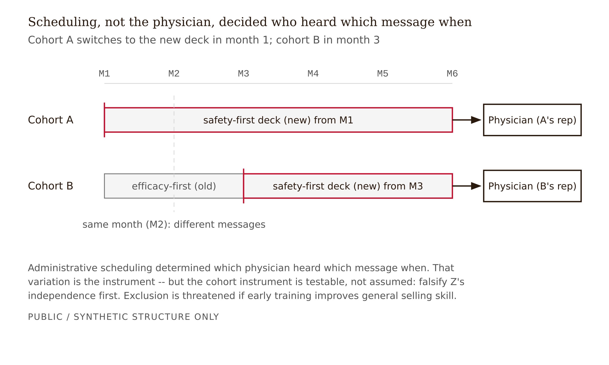
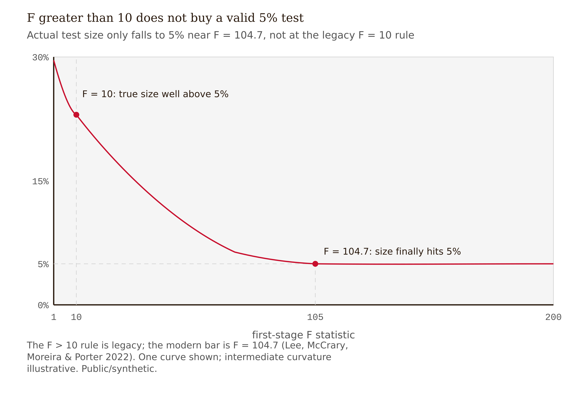

# Chapter 4 — The Natural Experiment in Every Training Rollout
*The experiment has been running for fifteen years. Nobody noticed because nobody was looking for it.*

A Fellows team is handed a brand's message transition: in March the field began moving from an efficacy-first deck to a safety-first deck, and by June most reps had switched. The team wants the effect of the safety-first message on new prescriptions. They reason cleanly, or so they think. Physicians whose reps were early in the rollout got the safety message sooner; physicians whose reps switched later got it later. Compare 60-day prescribing between early-exposed and late-exposed physicians, control for specialty and territory, and read off the effect.

The estimate comes back large, positive, and tight. The safety-first message, they conclude, lifts new prescriptions by a meaningful margin. The brand is delighted. A senior reviewer asks one question: *who got trained first?*

It turns out the brand's best reps were trained first. Star performers go to the front of the rollout queue — they are trusted with the new message, they are managed more closely, and they were already assigned the higher-potential territories. So "trained early" is a proxy for "called on by a great rep in a great territory." The early-exposed physicians were always going to prescribe more, message or no message. The team did not measure the effect of the safety-first message. They measured the effect of being covered by a star rep, and pinned the label "message effect" on it.

Two things went wrong, and they are the two failure modes this chapter exists to prevent. **Independence failed**: the timing of exposure was correlated with the physicians' baseline prescribing, because rep quality drove both. **Exclusion failed**: even setting baseline aside, early-trained reps sell better in general, so cohort timing affected prescribing through a channel other than the message. The team would have caught the first failure with a single regression — cohort timing on pre-rollout prescribing — run *before* any effect estimate. They never ran it.

That regression is the midterm.

---

## What a natural experiment is, and why this is one

A randomized controlled trial assigns treatment by a coin flip the experimenter controls. The coin flip guarantees that treated and untreated units are identical in everything except treatment, so any difference in outcomes is caused by treatment. A **natural experiment** borrows the same logic from the world: some process outside the analyst's control and unrelated to the outcome assigns units to treatment-like conditions as if by a coin flip.

The canonical examples are worth holding in mind because the pharma case is structurally identical to both.

Angrist and Krueger (1991, *Quarterly Journal of Economics* 106(4):979–1014) used **quarter of birth** as a lever on years of schooling. Compulsory-schooling laws tie school entry to the calendar, so children born in different quarters complete slightly different amounts of schooling for reasons that have nothing to do with their ability. The quarter of birth is unrelated to the outcome — earnings — except through its effect on schooling. Angrist (1990, *American Economic Review* 80(3):313–336, "Lifetime Earnings and the Vietnam Era Draft Lottery") used the **Vietnam draft lottery**, where a literal random number determined who served, as a lever on veteran status to estimate the effect of military service on earnings. In each case the lever is something administrative and arbitrary — a birthday, a lottery number — that nudges people into treatment without itself caring about the outcome.

In rep-visit data the lever is **training-cohort timing**. A new clinical message rolls out in waves. Reps in the month-1 cohort begin delivering the safety-first deck; reps in the month-2 cohort are still delivering the old efficacy-first deck during that same window. A physician's exposure to the new message is therefore determined, in part, by when her rep happened to be scheduled for training — a scheduling decision driven by regional logistics, hiring calendars, and trainer availability. The physician did not choose her message. She got it because of administrative decisions upstream of her rep. That is the as-if-random nudge.

Whether the nudge is *actually* as-good-as-random — rather than correlated with physician prescribing propensity through a mechanism like star-rep assignment — is not an assumption to state and move past. It is a **testable claim**, and you must test it before reporting any estimate. The test is the opening case's missing step.



*Figure 4.1 — The natural experiment: scheduling decided which physician heard which message when*

<!-- → [DIAGRAM: Two parallel timelines — "Training cohort A" and "Training cohort B" — with cohort A switching to the new deck in month 1 and cohort B in month 3. Arrows from each cohort to a sample physician, showing different message exposure for otherwise comparable physicians in the same month. Caption: "The natural experiment: administrative scheduling determined which physician heard which message when. That variation is the instrument."] -->

---

## The instrumental-variables framework, mapped to this dataset

An **instrumental variable** is a variable Z that affects the treatment D but affects the outcome Y *only through* D, and that is unrelated to whatever else confounds the D-to-Y relationship. If you have such a Z, you can recover the causal effect of D on Y even when D and Y share unmeasured confounders — which they badly do here. A physician's openness to a drug drives both how her rep details her and how she prescribes; those are tangled in any simple comparison.

The mapping for this design:

**Instrument Z** = training-cohort assignment — the rollout timing from HR and training records, specifically which cohort the rep was scheduled in and therefore when she could begin delivering the new deck.

**Treatment D** = message-variant exposure — which deck the physician's rep was actually delivering, recorded in the rep-entered key-message field in the CLM system.

**Outcome Y** = NPI-level new prescriptions at 30, 60, and 90 days after exposure, from the prescribing-data warehouse.

The estimation has two visible regressions. The **first stage** regresses treatment on the instrument: does cohort timing actually predict which deck got delivered? The **reduced form** regresses the outcome on the instrument: does cohort timing predict prescribing? The IV estimate is, roughly, the reduced form divided by the first stage — the part of the prescribing difference that travels through the message, scaled by how strongly the instrument moved the message.

A critical honesty point about *what* IV estimates. When treatment effects are heterogeneous — and they certainly are, since some physicians are persuadable and many are not — IV does not recover the average effect over everyone. It recovers the **Local Average Treatment Effect (LATE)**: the average effect among **compliers**, the physicians whose message exposure actually tracked their rep's cohort timing (Imbens & Angrist 1994, *Econometrica* 62(2):467–475; Angrist, Imbens & Rubin 1996, *JASA* 91(434):444–455). Physicians whose reps would have delivered the new deck regardless of training, or never, are not in the estimate. The LATE is real and useful, but it is a statement about a subpopulation you do not get to name in advance. Report it as such.


*Figure 4.2 — The IV structure: Z's only path to Y runs through D (cohort instrument testable, not assumed)*

<!-- → [DIAGRAM: Three-node DAG — training cohort (Z) → message variant (D) → NRx (Y). A dashed bidirectional arrow between an unlabeled "unobserved confounder" node and both D and Y. The Z→Y path is visibly absent except through D. Caption: "The IV structure: Z shifts D; the confounders corrupt the direct D→Y comparison; Z's only path to Y is through D."] -->

---

## The three conditions, and a fourth

An instrument earns its keep only if it satisfies three conditions. Each one is falsifiable on this dataset, and none should be assumed.

**Relevance.** Z must actually shift D: the instrument must move the treatment. If cohort timing barely changed which deck got delivered — because reps switched on their own schedule regardless of training, or because old slides lingered in the field — the instrument is *weak* and everything downstream is unreliable. The check is the **first-stage F-statistic** on the instrument. We are about to argue that the threshold you probably have in your head is wrong.

**Independence.** Z must be as-good-as-randomly assigned with respect to the physicians' potential outcomes — cohort timing must be uncorrelated with how much these physicians would prescribe anyway. This is exactly what failed in the opening case. It is **testable**, and you are required to test it: regress cohort assignment on pre-rollout prescribing. If early-trained reps systematically cover higher-baseline physicians, the coefficient is significant and the design is dead. You do not patch this; you stop and report the failure.

**Exclusion.** Z must affect Y *only through* D — cohort timing must change prescribing only by changing the message, with no direct side channel. The obvious threat: early training may also improve a rep's general selling skill, or grant more selling days, or more manager attention, or earlier sample supply within the measurement window. Exclusion is **not directly testable** — it is a statement about a channel you cannot observe — but you defend it by controlling rep tenure and baseline performance, so that "early-trained" is not standing in for "more experienced and better at selling," and by checking that the event-study leads are flat before the rollout.

A **fourth** assumption rides along with the LATE interpretation: **monotonicity** — no defiers. A defier would be a rep who, trained later, reverts to the old message, or one who, trained earlier, refuses the new one. Reps reverting to a familiar old deck is plausible enough to name explicitly. State monotonicity as an assumption, not a given.

---

## The F > 10 rule is wrong — here is what replaces it

Here is a misconception you very likely arrived with: *first-stage F > 10 means the instrument is strong enough to trust the inference.*

This is wrong, and now formally so.

The F > 10 threshold traces to Staiger and Stock (1997, *Econometrica* 65(3):557–586) and was sharpened by Stock and Yogo (2005, in Andrews and Stock, eds., *Identification and Inference for Econometric Models*, Cambridge UP) as a **relative-bias criterion**: F > 10 roughly guarantees that the bias of the 2SLS estimator is under about 10 percent of the bias of OLS. Notice what that controls — **bias**, the location of the estimate. It says nothing about whether the **t-test you actually report** has correct size.

Lee, McCrary, Moreira, and Porter (2022, *American Economic Review* 112(10):3260–3290) worked out what is actually required for the conventional 5 percent t-test (|t| > 1.96) to have correct size in the just-identified single-instrument case — which is exactly the case here, one cohort instrument. The answer is a first-stage F of roughly **104.7**, not 10. Their **tF procedure** fixes this by inflating the standard error as a smooth function of the observed F: weaker first stages get larger standard errors automatically. When they re-examined 61 published *AER* papers, about a quarter of specifications needed standard errors at least 49 percent larger to be valid at the 5 percent level. A quarter of peer-reviewed instrumental-variables results in a top journal were overstating their precision.

The threshold that controls one quantity — bias — does not license a claim about a different quantity — inferential precision. "Everyone uses F > 10" is not a defense.

The teaching move for this dataset: report the first-stage F, but do not stop there. With a single cohort instrument, apply the tF standard-error adjustment, and additionally report **Anderson–Rubin** weak-instrument-robust confidence sets, which stay valid however weak the instrument is. Use the **effective F** of Montiel Olea and Pflueger (2013, *Journal of Business & Economic Statistics* 31(3):358–369) because NRx data is clustered by rep and territory and the classical F assumes it is not. The review by Andrews, Stock, and Sun (2019, *Annual Review of Economics* 11:727–753) is the practitioner's summary and recommends exactly this combination.



*Figure 4.3 — F > 10 controls bias, not size; the tF correction is required for valid inference (weak-IV F>10 is legacy)*

<!-- → [CHART: Relationship between first-stage F-statistic and the effective size of a nominal 5% t-test — x-axis: F from 1 to 200; y-axis: actual test size. Horizontal line at 5%. The curve descends to 5% only around F ≈ 104.7. Vertical line at F = 10 showing the actual test size there is well above 5%. Caption: "F > 10 controls bias, not size. The tF correction is required for valid inference at conventional F values."] -->

---

## The staggered-rollout trap

Suppose independence and exclusion hold and you want to estimate the effect directly, treating "delivered the new deck" as a treatment that switches on at different times for different physicians. The natural move is a **two-way fixed effects (TWFE)** regression: outcome on a post-treatment dummy plus physician and time fixed effects. This is the workhorse difference-in-differences specification, and with staggered timing it is a trap.

Goodman-Bacon (2021, *Journal of Econometrics* 225(2):254–277) showed that staggered TWFE is a weighted average of all possible 2×2 difference-in-differences comparisons — and some of those comparisons are **forbidden**: they use already-treated early cohorts as the "control" group for later-treated cohorts. When treatment effects change over time, those forbidden comparisons enter with **negative weights**, so the TWFE coefficient can be a badly distorted, even sign-flipped, summary of the true effects. de Chaisemartin and D'Haultfœuille (2020, *AER* 110(9):2964–2996) independently demonstrated the negative-weighting problem. You can have every treatment effect positive and produce a negative TWFE coefficient.

The fix is a **heterogeneity-robust estimator** that never uses already-treated units as controls. Callaway and Sant'Anna (2021, *Journal of Econometrics* 225(2):200–230) estimate group-time average treatment effects using **not-yet-treated** cohorts as clean controls; Sun and Abraham (2021, *Journal of Econometrics* 225(2):175–199) give an interaction-weighted estimator that also exposes spurious pre-trends. Baker, Callaway, Cunningham, Goodman-Bacon, and Sant'Anna (2025, arXiv:2503.13323) is the current practitioner synthesis. The discipline: use a robust estimator with not-yet-trained cohorts as controls, then build the cohort instrument on top.

---

## Running the design, with the dead ends

Walk the design the way you should walk it, in order.

**Build the panel.** Link three layers. From the CLM rep-entered records, take the key-message field to identify which deck each physician's rep was delivering and when — treatment D. From HR and training records, take each rep's cohort timing — instrument Z. From the prescribing warehouse, take NPI-level new prescriptions at 30, 60, and 90 days — outcome Y — plus the physician's pre-rollout prescribing history. Add territory fixed effects, rep tenure, and a baseline rep-performance measure. The unit of analysis is physician by time.

**Run the falsification test first.** Before estimating anything, regress cohort assignment on pre-rollout prescribing, controlling for specialty and territory. This is the test the opening-case team skipped. If it comes back significant — early-trained reps systematically cover physicians whose pre-rollout prescribing was already higher — independence has failed. The honest action is to stop and report the failure. The design does not identify the message effect on this brand's rollout, and the deliverable is a memo saying so. This is not a setback to hide. It is the deliverable.

**Walk through the TWFE dead end.** Suppose falsification passes and you reach for the quick estimate: a TWFE regression of prescribing on a post-training dummy. Run the Goodman-Bacon decomposition on it before reporting the coefficient. You will likely find weight sitting on forbidden comparisons — late cohorts judged against already-trained early cohorts. Swap in Callaway–Sant'Anna using not-yet-trained cohorts as clean controls.

**Estimate, with honest inference.** Run the first stage and confirm relevance. Report the effective F and, if it is anywhere near the zone where the legacy rule fails, the tF-adjusted standard error and the Anderson–Rubin confidence set. Then read off the IV estimate of the message effect, controlling rep tenure and baseline performance to defend exclusion, and check that the event-study leads are flat before the rollout begins.

**Name the limit.** A clean estimate gives you a **population LATE for compliers** — the average effect of the safety-first message among physicians whose exposure actually tracked cohort timing. It does not tell the brand which message to deliver to a specific physician next week. That individual counterfactual question is a Rung-3 question and is handed to Chapter 9. And the LATE is a total effect — it lumps together every channel by which the message moved prescribing. Chapter 5 pulls that total apart into pathways, because the channels carry different ethical and regulatory weight.

---

## The named artifact: the IV plus falsification design

Produce a one-page identification design for a specific message transition in your thread's data. In order:

1. **The three-node DAG**, showing the instrument visibly upstream of treatment and the unmeasured confounder's paths to both treatment and outcome.

2. **The IV mapping**: one line each naming Z, D, and Y with the exact field or record each comes from.

3. **The three conditions with their checks**: relevance with the first-stage F plan and tF correction; independence with the falsification regression written out explicitly; exclusion with the control set and the flat-leads requirement. One additional line stating the monotonicity assumption.

4. **The kill criterion**: the explicit rule — if the falsification coefficient is significant at the 5 percent level, the design is abandoned and reported as failed.

The grading emphasis is order of operations. A design that shows an effect estimate before establishing that the falsification test passes is marked incomplete, by construction.

---

## What would change my mind

The chapter's central claim — that cohort timing is a usable instrument — is conditional, not universal. It holds only if independence survives the falsification test on a particular brand's rollout. If, run across multiple real rollouts, the test failed routinely because high-potential territories are systematically front-loaded, the instrument would be invalid in practice even though it is sound in principle. The chapter would have to retreat to "valid only in the rare rollout where logistics genuinely dominate scheduling."

A second revision would follow if early training so reliably improves a rep's general selling skill that the exclusion restriction cannot be defended by tenure and baseline controls. That would move cohort timing from "conditional instrument" to "not an instrument."

## Still puzzling

How large is the complier subpopulation in practice? If most reps switch decks on their own schedule regardless of training, the complier group could be small and unrepresentative, and the LATE would answer a question about a sliver of the market. There is no fully satisfying way to characterize compliers from the data alone.

It is also unresolved how to combine the cohort instrument with the staggered-DiD machinery in a formally clean way. The chapter teaches both and says "build the instrument on top of the robust estimator," but the joint estimand is a live methodological question.

---

## Exercises

**Warm-up**

1. *(Recall — tests the natural-experiment structure)* For the draft-lottery and quarter-of-birth natural experiments, name Z, D, and Y in each, and state in one sentence why the instrument plausibly satisfies exclusion. Then do the same for the cohort-rollout design. *What this tests: whether you can read the IV structure from a narrative description rather than a formula.*

2. *(Recall — tests the F-statistic correction)* A colleague reports a first-stage F of 22 and declares the instrument is strong. Using Lee et al. (2022), explain what is wrong with that conclusion, and state what you would compute instead before believing any inference based on that F. *What this tests: whether you understand that the F > 10 rule controls bias, not inferential size, and can name the correction.*

3. *(Recall — tests the LATE)* Explain, in plain language, why IV does not recover the average treatment effect when treatment effects are heterogeneous, and name the subpopulation whose effect it does recover. Then describe one way that subpopulation might differ from the full physician population in a rep-visit setting. *What this tests: whether you can state the LATE definition and its practical limitation without jargon.*

**Application**

4. *(Apply — tests the falsification design)* Write the falsification regression for a training-cohort rollout explicitly: state the dependent variable, the key independent variable, the covariates to include, and the rule that determines whether the design proceeds or is abandoned. Then explain what a significant positive coefficient on the key independent variable would mean about the opening-case failure mode. *What this tests: whether you can specify the test before seeing any results.*

5. *(Apply — runs the pipeline)* On the synthetic rep-visit dataset, run the falsification regression twice: once on a version with a planted independence violation, once on a clean version. Report both coefficients, both p-values, and for each state whether you would proceed to estimation. *What this tests: whether you can run the test and apply the kill criterion without softening a failure.*

6. *(Apply — TWFE trap)* A colleague estimates a staggered TWFE regression of prescribing on a post-training dummy and finds a negative coefficient. They conclude the new deck hurts prescribing. Explain, in language a non-econometrician could follow, how a negative coefficient is consistent with every individual group-time treatment effect being positive. Name the fix. *What this tests: whether you understand the negative-weighting problem intuitively, not just technically.*

**Synthesis**

7. *(Synthesize — IV + staggered DiD)* Explain why, even after switching from TWFE to Callaway–Sant'Anna, you still need the cohort instrument rather than treating deck-delivered as the treatment directly. What unmeasured confounder does the instrument address that the robust DiD estimator alone cannot? *What this tests: whether you understand the distinct roles of the identification strategy (DiD) and the instrument (IV) in the combined design.*

8. *(Synthesize — all three conditions)* Return to the opening case and map both failures to the three IV conditions: which condition did "star reps trained first" violate, and which did "early training improves general selling skill" violate? For each failure, state whether it is testable or must be argued, and what evidence or control would address it. *What this tests: whether you can diagnose a failed design precisely rather than generically.*

**Challenge**

9. *(Challenge — produce the named artifact)* Build the full identification design of §8 for a message transition in your thread's data: the three-node DAG, the IV mapping with exact field names, all three conditions with their checks and the tF correction plan, the monotonicity statement, and the explicit pre-registered kill criterion. Submit it before running any estimate. *What this tests: whether you can execute the order-of-operations discipline — design before estimation — as a complete artifact rather than as a checklist.*

---

## Prompts

### Figure 4.1 — The natural experiment: scheduling decided which physician heard which message when

Produce a single self-contained HTML file (inline CSS, D3 7.9.0 from the cdnjs CDN) rendering a two-track timeline diagram. Chart type: parallel horizontal timelines, not a quantitative chart — no axes from data. Data shape: two cohort tracks ("Training cohort A", "Training cohort B"), each a horizontal lane spanning months 1 through 6; cohort A switches from the old efficacy-first deck to the new safety-first deck at month 1, cohort B at month 3. Marks: two lanes as light rectangles, a deck-switch marker (vertical tick) on each lane at its switch month, and two physician nodes on the right, each linked by an arrow back to one cohort track to show different message exposure in the same calendar month. Channels: vertical position separates the two cohorts; horizontal position is calendar time; a single red accent marks the new-deck segment. No zero-baseline question (categorical/temporal). Annotations: a caption stating that administrative scheduling, not physician choice, determined message timing, and a note that this variation is the instrument. Brutalist style: white background, ink #2a1a0e, one red data accent #C8102E, hairline #D4D4D4, EB Garamond title / Inter body / JetBrains Mono labels. Deliverable: one HTML file.

### Figure 4.2 — The IV structure: Z's only path to Y runs through D

Produce a single self-contained HTML file (inline CSS, D3 7.9.0 from the cdnjs CDN) rendering a causal directed-acyclic graph. Chart type: node-link DAG laid out left-to-right. Data shape: three observed nodes on a horizontal spine — training-cohort assignment (Z, instrument), message-variant exposure (D, treatment), NRx (Y, outcome) — plus one latent confounder node (physician openness) above center drawn with a dashed outline. Marks: rectangles for observed nodes, a dashed-outline node for the latent confounder, directed arrows Z→D and D→Y as the identified red chain, dashed arrows from the latent confounder into both D and Y, and a deliberately absent Z→Y edge annotated as the exclusion restriction. Channels: horizontal position encodes causal order; line style (solid vs dashed) distinguishes observed from latent; red marks the one identified path. No quantitative axes. Annotations: label that the absent Z→Y edge is the exclusion restriction; caption that the cohort instrument is testable, not assumed, and exclusion is threatened if early training improves general selling skill. Brutalist palette and font chains as above. Deliverable: one HTML file.

### Figure 4.3 — F > 10 controls bias, not size

Produce a single self-contained HTML file (inline CSS, D3 7.9.0 from the cdnjs CDN) rendering a line chart. Chart type: single-series monotone-decreasing line. Data shape: x = first-stage F-statistic from 1 to 200; y = actual size of a nominal 5 percent t-test, descending from roughly 30 percent at low F and asymptotically approaching 5 percent. Marks: one red line, two emphasis dots where the curve crosses the F=10 and F=104.7 vertical guides, a dashed horizontal reference at 5 percent, and two dashed vertical guides at F=10 and F=104.7. Channels: x position = F, y position = test size; a single red series. Sort: by x ascending. Zero-baseline y: yes (y axis starts at 0 percent). Annotations: label "F = 10: true size well above 5%" and "F = 104.7: size finally hits 5%"; caption noting F>10 is the legacy bias-control rule and the modern size-valid bar is F≈104.7 (Lee, McCrary, Moreira & Porter 2022), curve illustrative. Brutalist palette, chart margins top 48 / right 40 / bottom 56 / left 64, font chains as above. Deliverable: one HTML file.

---

## Chapter 4 Exercises: The Natural Experiment in Every Training Rollout

**Project:** The Causal Interview Bot
**This chapter adds:** IV-assumption probes — bot questions that ask the rep whether the training-cohort timing was as-good-as-random for a given physician, surfacing threats to independence and exclusion the rollout calendar alone cannot reveal.

### Exercise 1 — When to Use AI

Three tasks the model handles cleanly.

First, **drafting rep-natural questions that probe how cohorts were scheduled.** You want questions like "who on your team got trained on the new deck first, and why them?" — phrased so a rep just answers. *Why AI works here:* drafting in a constrained register, option-generation you cull. **The tell:** you can judge whether each question would surface the star-rep-first pattern.

Second, **enumerating the ways independence could fail.** Ask the model to list every reason cohort timing might correlate with physician prescribing propensity. *Why AI works here:* breadth-of-threats is a brainstorming task, and you keep only the real ones. **The tell:** you can map each listed threat to a concrete falsification check.

Third, **reformatting HR/training scheduling notes into a structured timeline.** *Why AI works here:* mechanical structure-imposition on text you supply. **The tell:** the source schedule sits beside the output.

### Exercise 2 — When NOT to Use AI

Two judgments the model cannot make.

First, **deciding whether the cohort timing was actually as-good-as-random for this brand's rollout.** *Why AI fails here:* this is the independence assumption — the core causal-identification call — and it depends on facts about who got trained first and why that exist only in this rollout's history, not in the model's training data. The model will assert "plausibly random" with unearned confidence. **The tell:** if the model's verdict is your *reason* for proceeding to estimation, you have skipped the falsification test; if you use it only to generate the questions that surface the scheduling facts, you have used it as a tool.

Second, **judging whether the exclusion restriction holds** — whether early training improved general selling skill, a side channel the data cannot see. *Why AI fails here:* exclusion is not testable; it is argued from domain facts the model lacks. **The tell:** the model can list exclusion threats; it cannot certify the restriction. **Series connection:** this is a **T5 (Causal)** task — the independence and exclusion judgments are the identification strategy itself, and the bot's role is to elicit the scheduling history a human needs to defend or kill the instrument.

### Exercise 3 — LLM Exercise

**What you're building this chapter:** the bot's *IV-assumption probe set* — rep-natural questions that surface, for a specific physician and rollout, whether cohort timing was plausibly as-good-as-random (independence) and whether early training carried side effects beyond the message (exclusion).

**Tool:** the **Claude Project** ("Causal Interview Bot"). The Project holds the ladder-structured bank from Chapter 3; these probes are Rung-2 questions about the instrument, so they extend the existing rung structure rather than starting fresh.

**The Prompt:**

```
Building on the ladder-structured question bank already in this Project, write the
bot's INSTRUMENT-PROBE set for a training-cohort natural experiment.

Background (do NOT use this language with the rep): we are using training-cohort
timing as an instrument for which message a physician's rep delivered. For the
instrument to be valid, two things must roughly hold:
- INDEPENDENCE: which reps were trained first must be unrelated to how much their
  physicians were already going to prescribe. (It FAILS if star reps with
  high-potential territories were trained first.)
- EXCLUSION: training timing must affect prescribing ONLY through the message, not
  through a side channel (e.g., early-trained reps also got more selling days, more
  manager attention, earlier samples, or simply sell better in general).

Concrete scenario: Dr. Castellano, a rheumatologist, is covered by a rep who was in
the FIRST training cohort for the new safety-first deck.

Produce, in rep-natural English with NO jargon (no "instrument," "independence,"
"exclusion," "confounder," "as-good-as-random"):

1. THREE questions that surface HOW cohorts were scheduled and whether the
   best reps / best territories went first (independence threats).
2. THREE questions that surface whether being trained early changed anything OTHER
   than which slides the rep showed — more selling time, more samples, more coaching
   (exclusion threats).

After EACH question, add a bracketed note to ME naming which assumption it probes
and what answer would be a red flag for the instrument. Do not tell me whether the
instrument is valid — only design questions that surface the facts I need to judge.
```

**What this produces:** six rep-natural probes — three for independence, three for exclusion — each annotated with the assumption it tests and the answer that would threaten the design.

**How to adapt:** *For your dataset:* replace Dr. Castellano and the safety-first rollout with a real message transition and a real first-cohort rep from your panel. *For ChatGPT/Gemini:* prepend the Chapter 3 question bank. *For a Claude Project:* the assumption definitions go in the system prompt; send the scenario and the two-part request as a message.

**Connection to previous chapters:** Chapter 3 gave the bot Rung-2 questions about what would move a physician; this chapter points those Rung-2 questions at the *instrument itself*, eliciting the scheduling facts that decide whether the natural experiment is real.

**Preview of next chapter:** Chapter 5 adds questions that separate the three pathways — education, relationship-maintenance, reciprocity — so the bot can attribute an elicited effect to a channel, not just confirm the effect exists.

### Exercise 4 — CLI Exercise

**What you're building:** a falsification-first probe file plus a synthetic-data check that the bot's independence probes line up with the actual (synthetic) rollout calendar — encoding the chapter's order-of-operations discipline.

**Tool:** Claude Code — because the discipline (test independence before estimating) is best enforced as code that refuses to proceed, and the probes belong in the versioned question bank. **Skill level:** Advanced.

**Setup:**
1. Prereq artifact: the six instrument probes from Exercise 3, plus the synthetic panel from Chapter 2's CLI work.
2. Tool: Claude Code in the bot repo.
3. CLAUDE.md rule: synthetic-only; add "Any estimate must be preceded by the independence falsification test; code that estimates without it is a bug."

**The Task:**

```
Work only inside this repo, synthetic data only. Two deliverables:

1. Append to spec/interview-stems.md a section "## Chapter 4 — Instrument probes
   (independence + exclusion)" and write in the six probes I paste, each with an
   HTML comment <!-- probes: independence|exclusion; red_flag: ... -->.

2. Write checks/falsification_first.py against data/synthetic/panel.csv (create a
   small synthetic panel with columns npi, cohort_order, pre_rollout_NRx,
   message_delivered, NRx_60d if it does not exist). The script must:
   (a) regress cohort_order on pre_rollout_NRx (controlling for a synthetic
       specialty column) and print the coefficient and p-value;
   (b) if p < 0.05, print "INDEPENDENCE FAILED — design abandoned" and sys.exit(1)
       BEFORE any effect estimate;
   (c) only if it passes, print "independence OK — proceed" and stop (do NOT
       estimate the effect; estimation is out of scope here).

Read/modify only these two files. Leave the rest alone.

Verification step: run the script twice — once on the panel as given, once after
flipping it to a planted-violation version (make cohort_order correlate with
pre_rollout_NRx). Confirm the clean run prints "proceed" and the violated run exits
with code 1. Print both outcomes.
```

**Expected output:** the updated probe section, plus a `falsification_first.py` that exits 1 on the planted-violation panel and prints "proceed" on the clean one.

**What to inspect:** confirm the script exits *before* any estimate when independence fails — read the control flow, don't just trust the printout. Confirm the regression controls for specialty as specified.

**If it goes wrong:** the typical failure is the agent computing an effect estimate anyway, "for completeness." Recovery: re-run with the explicit "estimation is out of scope; exit before estimating on failure" instruction, and check the `sys.exit(1)` sits above any modeling code.

**CLAUDE.md note:** keep the "no estimate before falsification" rule — it is the order-of-operations discipline encoded so the bot's downstream prior can't inherit a dead instrument.

### Exercise 5 — AI Validation Exercise

**What you're validating:** the instrument probes from Exercise 3 — whether they genuinely surface the scheduling facts, or lead the rep into confirming the instrument is fine.

**Validation type:** Reasoning · **Risk level:** High — a probe that leads the rep to say "yeah, scheduling was basically random" gives false comfort that lets a dead instrument through, and every downstream estimate inherits the failure.

**Setup:** use your Exercise 3 probes. If clean, inject a leading one — "training was just whoever was available, right?" — to confirm your checklist catches it.

**The Validation Task:**

```
Validation Checklist — Chapter 4 (Instrument Probes)

For each probe, mark Pass / Fail / Cannot-determine on:

1. Correctness — does the probe surface a FACT about scheduling or side channels,
   rather than ask the rep to endorse a conclusion?
2. Completeness — do the six probes cover both independence (who trained first and
   why) and exclusion (what else early training changed)?
3. Scope — is every rep-facing string free of jargon (instrument, independence,
   exclusion, as-good-as-random)?
4. Chapter-specific: Red-flag reachability — for each probe, is there an honest rep
   answer that would threaten the instrument, or does the question only admit
   reassuring answers?
5. Chapter-specific: Independence vs exclusion separation — is each probe clearly
   pointed at one assumption, not muddling both?
6. Failure-mode check — leading-the-witness: does any probe presuppose the
   instrument is valid ("scheduling was random, right?")? A probe can be fluent and
   on-topic and still steer the rep toward the answer that saves the design. Flag
   it. Also flag any case where you cannot tell from the rep's likely answer whether
   independence holds (missing ground truth — by design the bot surfaces facts, the
   falsification test decides).
```

**What to do with findings:** all pass — commit the probes and wire them ahead of the falsification script. One fail — rewrite that probe to be fact-eliciting and neutral. Multiple uncertain — the probe set is leading; regenerate with the "no probe may presuppose validity" rule.

**AI Use Disclosure prompt:** *Write two sentences naming what an AI tool did in your Chapter 4 work and the one judgment it could not make. The judgment most specific here: whether the cohort timing was as-good-as-random on this brand's rollout — a domain fact about who got trained first and why that the model does not have and cannot verify, and that only the falsification test plus the rep's honest answers can settle.*

**Series connection:** the failure mode is **leading-the-witness** into a false all-clear on the instrument, which maps to **T5 (Causal)**: independence and exclusion are the identification claim, and the bot's job is to surface the scheduling history a human uses to defend or abandon the natural experiment — never to bless it.
