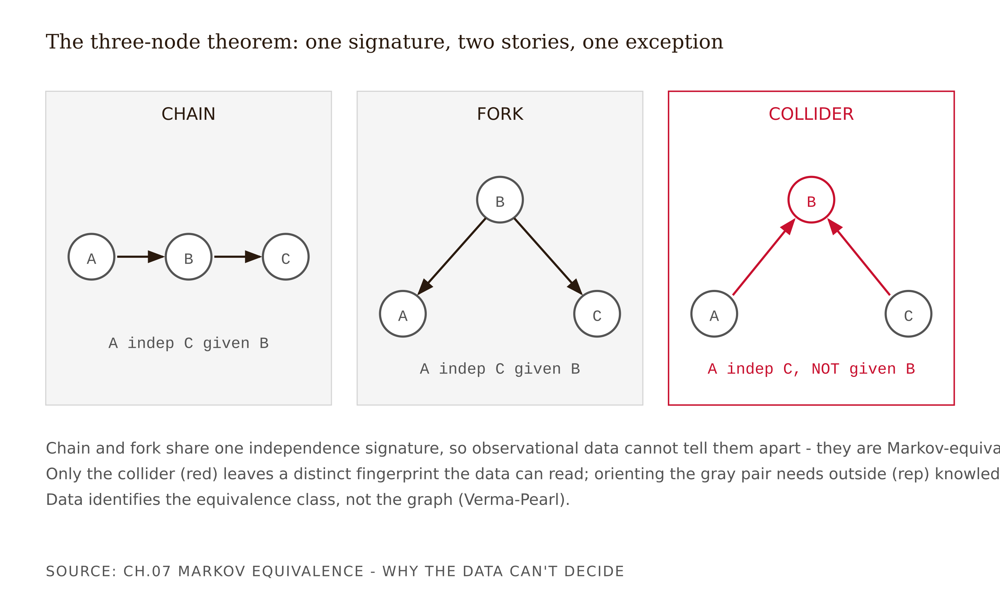
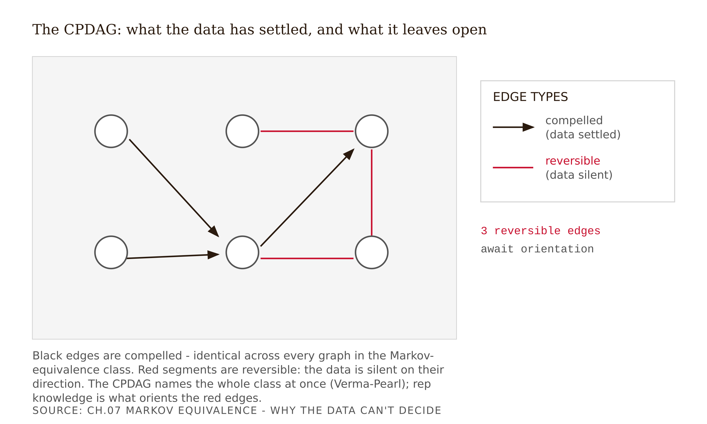
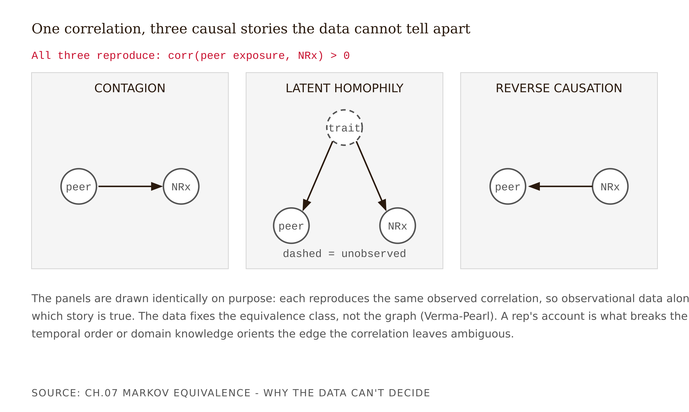

# Chapter 7 — Markov Equivalence: Why the Data Can't Decide
*The data speaks only one language. Multiple causal stories speak it identically. This is not a gap in your dataset — it is a theorem.*

A martech vendor pitches your partner a "causal influence engine." The slide is gorgeous: a physician-network graph, NPIs as nodes, arrows between them, a few thick red arrows pointing into a cluster of high-prescribing cardiologists labeled "KEY INFLUENCERS — TARGET THESE." The vendor's claim is that their causal-discovery algorithm learned the graph from prescribing and referral data, found who influences whom, and that detailing the influencers will cascade through the network. The recommended budget reallocation is eight figures.

A Fellow on the project asks one question: "How did the algorithm decide the arrow points *from* the influencer *to* the followers, rather than the other way around?"

The room goes quiet, because the honest answer is: it didn't decide. It couldn't. The edge between "exposed to a peer's prescribing" and "prescribes" is — as we are about to prove — *reversible*. The data is equally consistent with "the influencer caused the followers to switch," "the followers are high prescribers who became visible and got labeled influencers," and "both groups share an underlying openness to the drug and there is no influence at all." The algorithm returned one of these because it had to draw *something* on the screen. The thick red arrow is a coin flip wearing a confidence interval.

The vendor was not lying about the math. The discovery algorithm ran correctly. The unexamined assumption — which in a procurement deck is the same as a lie — is that "the algorithm produced a DAG" implies "the DAG is the causal truth." It does not. It produced a *member of an equivalence class*, and hid the rest of the class behind a single rendering. Acting on the displayed arrows means targeting "influencers" who may simply be sure-things who would prescribe anyway — burning budget on people the drug already has.

The rest of this chapter is the machinery behind the Fellow's question.

---

## What observational data can and cannot see

Start from what a dataset actually contains. A purely observational panel — rows of physicians, columns of measurements, no experiment you ran — reveals exactly one kind of structural fact: **conditional-independence relations**. It tells you that variable A and variable C are correlated, and that the correlation vanishes once you hold B fixed (written A ⊥ C | B), or that it does not. Every pattern, partial correlation, and independence test you can compute is, in the end, a statement about which variables are independent of which others given which third sets.

That is the whole vocabulary the data speaks. And here is the trap: multiple distinct causal graphs can speak the exact same vocabulary. When two graphs imply the identical set of conditional-independence relations, no test — no matter how much data you feed it — can prefer one over the other. They are **Markov equivalent**, and the set of all such graphs is the **Markov-equivalence class**.

This is the most important sentence in the chapter: *observational data can identify a causal graph only up to its equivalence class — never the unique graph.* The rest is showing you why that is true, and what to do about it.

---

## The three-node theorem

The entire lesson lives in three variables. Forget pharma for a page and consider A, B, C.

**Chain: A → B → C.** A causes B; B causes C. The independence signature: A and C are marginally dependent (information flows from A to C through B), but A ⊥ C | B — once you know B, A tells you nothing more about C. The middle node blocks the path when you condition on it.

**Fork (common cause): A ← B → C.** B causes both A and C; A and C have no direct link. The signature: A and C are marginally dependent because they share the common cause B, but A ⊥ C | B — conditioning on the shared cause kills the correlation.

Read those two signatures again. They are identical. A ⊥ C | B, with A and C marginally dependent. The chain "A causes C through B" and the fork "B is a common cause of A and C" are *indistinguishable in the data*. They share a skeleton (the same three undirected connections: A–B, B–C) and neither creates a v-structure. They are Markov equivalent. No dataset, however large, can tell you whether B is a mediator on the path from A to C or a confounder behind both.

Now the exception that proves the rule.

**Collider: A → B ← C.** A and C both cause B; they are otherwise unrelated. The signature is *opposite*: A and C are marginally **independent** — no path connects them with B unconditioned, because B is a closed gate — but they become **dependent given B**. Conditioning on the collider opens the path. This is exactly the collider bias you met in Chapter 6. The collider has a different independence signature from the chain and fork, so it sits in its own equivalence class and *is* identifiable from data.

This ties the last two chapters together at the joint. The one three-node structure the data *can* orient is the collider — the v-structure. And the v-structure is precisely the thing you learned to fear in Chapter 6 for the bias it creates when you condition on it. The same feature that makes colliders dangerous is what makes them visible to discovery algorithms. Colliders are the only arrows the data draws for you. Every other arrow it guesses.


*Figure 7.1 — The three-node theorem. Chain and fork share one independence signature; only the collider is identifiable. Observational data fixes the equivalence class, not the unique graph (Verma–Pearl).*

<!-- → [DIAGRAM: Three panels side by side — Chain (A→B→C), Fork (A←B→C), Collider (A→B←C). Under Chain and Fork: "A ⊥ C | B — data cannot distinguish these." Under Collider: "A and C independent marginally, dependent given B — data can identify this." Caption: "The three-node theorem. Two structures share an independence signature; one is unique. Colliders are the only arrows observational data orients."] -->

---

## The Verma–Pearl criterion

The three-node case generalizes into a clean theorem. Verma and Pearl (1990) proved the operational test:

> Two DAGs are Markov equivalent if and only if they have (a) the same **skeleton** — the same undirected adjacencies — and (b) the same set of **v-structures**.

Everything else about the orientation — every edge not forced by a v-structure — is free to flip across members of the class. Verma was Pearl's student; the result is the formal backbone of the intuition Pearl later popularized in *The Book of Why*: you cannot read causation off correlation, because correlation only fixes the equivalence class, and the class generally has more than one member. (Verma & Pearl, "Equivalence and synthesis of causal models," *Proc. 6th Conf. on Uncertainty in Artificial Intelligence (UAI 1990)*, pp. 255–270.)

---

## The CPDAG: a two-color map of what you know and don't

The equivalence class has a canonical picture called the **CPDAG** — completed partially directed acyclic graph, also called the essential graph. Think of it as a two-color map.

**Directed edges are compelled.** They point the same way in every member of the class. The data settled these — typically because they participate in a v-structure or are forced by one through propagation. You can trust them.

**Undirected edges are reversible.** They flip across members. The data is silent on their direction. Every undirected edge is a place where the data has done all it can and an expert must supply the arrow.

This picture makes the necessity of rep knowledge concrete and countable. Run a discovery algorithm honestly and it returns a CPDAG, not a DAG. Count the undirected edges. That number is exactly how many interview questions Chapter 8 has to answer. The vendor's failure in the opening case was rendering a CPDAG's undirected edge as a directed one and printing it in red.

---

## Why outside knowledge is mathematically necessary

Within an equivalence class the orientation of reversible edges is **empirically underdetermined**. This is not "hard to estimate." It is "the observational data is fully exhausted and still cannot choose." Breaking the tie requires information from outside the data, of which there are exactly three kinds.

**Temporal order.** Causes precede effects. If you know A happened before B, B cannot cause A. When the sequence is recorded in timestamps, that knowledge is available without an interview.

**Interventions.** If you can set A and watch B move, you have orientation — but that is an experiment, the expensive thing this entire book is a workaround for.

**Background or domain knowledge.** A credible structural claim from someone who understands the mechanism.

Meek (1995, "Causal inference and causal explanation with background knowledge," *Proc. 11th Conf. on Uncertainty in Artificial Intelligence (UAI 1995)*, pp. 403–410) showed how such knowledge enters formally: assert one edge direction as a constraint, and orientation rules propagate it — a single expert-oriented edge can cascade into several more becoming compelled. One good rep observation can orient more than one arrow.

The philosophy underneath is Nancy Cartwright's slogan: **"no causes in, no causes out"** (the title of ch. 2 of *Nature's Capacities and Their Measurement*, Oxford: Clarendon Press, 1989, pp. 39–90). You cannot squeeze a causal conclusion out of purely associational premises. Some causal assumption must be an input. The broader discovery literature agrees: even the equivalence-class result itself rests on assumptions — causal Markov, faithfulness, and causal sufficiency (Spirtes, Glymour & Scheines 2000). Faithfulness — the assumption that no two real causal paths cancel so perfectly that a genuine dependence looks like zero — is usually reasonable but can be violated in systems with feedback and incentives. We carry that caveat forward.

This is the book's thesis in miniature. The rep interviews are not soft supplementary color. They are the *source* of the structural information the data provably cannot contain. Demote them and the arrows that decide where eight figures of detailing go become coin flips.


*Figure 7.2 — The CPDAG two-color map: compelled edges the data settled versus reversible edges left open. The data identifies only the equivalence class (Verma–Pearl); rep knowledge orients the reversible edges.*

<!-- → [DIAGRAM: CPDAG with a mix of directed and undirected edges. Directed edges labeled "compelled — data settled." Undirected edges labeled "reversible — rep must orient." Count of undirected edges annotated as "N open questions for Chapter 8." Caption: "The CPDAG is a two-color map: what the data decided, and what it left open for domain knowledge to close."] -->

---

## The peer-influence puzzle: the theorem in a lab coat

Return to the panel. For each physician you have a measure of exposure to peer prescribing — a colleague in the same practice or referral network switched to the drug — and the physician's own prescribing. They are correlated: physicians whose peers prescribe are more likely to prescribe. The brand wants to know if it can buy prescribing by buying influence.

**Three Markov-equivalent stories.** The correlation is consistent with three structures, and they are the three-node theorem wearing a lab coat.

Story A — *Contagion*: peer influence → prescribing. The colleague's switch genuinely moves the physician. This is the story the brand wants to be true.

Story B — *Latent homophily*: common cause. An underlying trait — openness to new therapies, an academic practice setting, a shared formulary policy — drives both who clusters with whom and prescribing. There is no influence at all; both are downstream of the same latent factor.

Story C — *Reverse causation*: prescribing → perceived influence. High prescribers become visible, get cited, get labeled "influencers." The arrow runs from prescribing to the influence measure, not the other way.

**The dead end.** The tempting move: run a discovery algorithm, read off the graph, report "peer influence causes prescribing — target the influencers." You will get a graph with an arrow on that edge, and it will look authoritative. But the algorithm returned a CPDAG in which that edge is undirected. If your software displayed a directed edge, it picked one orientation by an internal tie-breaking rule. You did not discover the arrow. The software guessed it, and you reported the guess as a finding. This is the opening-case vendor's exact error, committed by your own hands.

**It is a theorem, not a quirk.** Shalizi and Thomas (2011) proved that contagion, latent homophily, and individual-covariate effects are **generically confounded** in observational social-network data — without strong parametric assumptions or measurement of the right covariates, they are observationally indistinguishable (Shalizi & Thomas, *Sociological Methods & Research* 40(2):211–239; arXiv:1004.4704). "Generically" is the load-bearing word. This is not an artifact you could clean up with a better estimator or more rows. The three stories are confounded as a structural fact.

**What breaks the tie.** Information from outside the panel. The experienced rep supplies it: "I've watched Dr. Johnson switch within two weeks of a colleague switching, more than once. I have never once seen it run the other way." That is a temporal-plus-structural observation. It rules out story C and favors A over B — she is reporting something that looks like a response, repeated across cases, even if she never formally ran an experiment. Fed in as a Meek constraint, it may orient neighboring edges too.

**The limit.** Rep knowledge is fallible and uneven. One rep's "I've never seen it run the other way" is a sample of her territory, her memory, and her attention. The orientation she licenses is a **prior with a confidence level**, not a certainty. That is exactly why the artifact you build in Chapter 8 is an *annotated* prior DAG — each edge tagged with the rep evidence, a confidence, and any contradictions. Where reps disagree or hedge, the honest output is a sensitivity analysis across the surviving equivalence class, not a forced single graph. Necessity-in-principle (Verma–Pearl says *some* outside knowledge must orient the edge) does not mean the rep is always right. It means the rep is the only candidate in the room.


*Figure 7.3 — The peer-influence puzzle: contagion, homophily, and reverse causation fit the data identically. Observational data identifies only the equivalence class (Verma–Pearl); the algorithm cannot choose, but the rep can.*

<!-- → [DIAGRAM: Three side-by-side mini-graphs — Story A (peer_exposure → NRx), Story B (latent_trait → peer_exposure and latent_trait → NRx), Story C (NRx → peer_exposure). All three consistent with the same positive observed correlation. Caption: "The peer-influence puzzle: contagion, homophily, and reverse causation fit the data identically. The algorithm cannot choose. The rep can."] -->

---

## The named artifact: the equivalence map

Produce a one-page equivalence map for a correlation in your panel. Three columns:

**The correlation**, stated as an observational fact: which two variables are associated, and what the association looks like conditionally.

**The Markov-equivalent stories**, enumerated: each drawn as a mini-graph with its independence signature, and a sentence on why it fits the data equally well.

**The orienting evidence**, edge by edge: for each reversible edge, what kind of outside information would orient it, the specific rep observation that could supply it, and the confidence and contradictions to flag.

The deliverable is not "here is the causal graph." It is "here is exactly what the data settled, exactly what it left open, and exactly what evidence — available only from the rep — would close each open edge." That document is the input to the Chapter 8 interview design.

---

## What would change my mind

I would weaken the "rep knowledge is necessary" claim if a method emerged that orients reversible edges from observational data without an outside assumption — but that is logically impossible under Verma–Pearl, so the realistic version is: I would update on *which* outside source is best. If structured elicitation from reps turned out, on a real benchmark, to orient edges less accurately than a well-chosen literature prior or a cheap quasi-experiment, then the rep would remain *a* necessary outside source but not the *preferred* one. The necessity is a theorem; the supremacy of rep elicitation over other outside sources is a bet, and a benchmark could move it.

## Still puzzling

Faithfulness sits uneasily under all of this. The whole story assumes no near-perfect cancellation of paths. In a system with feedback and incentives — formularies that adjust to prescribing, reps who shift effort toward responsive physicians — there could be structures where two real causal effects genuinely cancel, so an edge drops out of the skeleton entirely. If the skeleton itself is missing an edge, even a perfect interview can only orient edges the skeleton contains. How would a rep's knowledge surface an edge the skeleton lost? The Shalizi–Thomas result makes this sharper, not easier: if the three peer-influence stories are generically confounded, and one of them involves a latent variable the panel cannot measure, the skeleton may never recover the full structure regardless of how the rep orients what is visible.

---

## Exercises

**Warm-up**

1. *(Recall — tests the three-node theorem)* Write out the conditional-independence signature for each of A → B → C, A ← B → C, and A → B ← C. State which two are Markov equivalent and why, and which one the data can orient and why. No code required — this is the theorem by hand. *What this tests: whether you can derive the core result without a formula.*

2. *(Recall — tests the CPDAG)* Define a compelled edge and a reversible edge in your own words. Explain why the count of reversible edges in a CPDAG is a meaningful number for a project that relies on rep elicitation. *What this tests: whether you can connect the abstract object to the practical consequence.*

3. *(Recall — tests Verma–Pearl)* State the Verma–Pearl criterion in one sentence. Then give one example of two three-node DAGs that satisfy it (same skeleton, same v-structures) and one example of two three-node DAGs that violate it (different v-structures). *What this tests: whether you can apply the criterion, not just recite it.*

**Application**

4. *(Apply — peer-influence enumeration)* Take the correlation between "samples left" and NRx in the rep-visit panel. Enumerate at least three Markov-equivalent structures — include a common-cause story and a reverse-causation story. For each, name the conditional independence it implies and explain in one sentence why observational data cannot rule it out. *What this tests: whether you can apply the equivalence-class reasoning to a new correlation.*

5. *(Apply — discovery run)* Run a causal-discovery algorithm on the synthetic rep-visit dataset and output the CPDAG, not a single DAG. Count the undirected edges. For each undirected edge, write the one-sentence interview question whose answer would orient it. Check your oriented guesses against the known ground-truth structure afterward. *What this tests: whether you can distinguish what the algorithm settled from what it guessed.*

6. *(Apply — vendor critique)* A vendor's slide shows a DAG over five physician-network variables, all edges directed, with a note that "the graph was learned from prescribing and referral data using a state-of-the-art causal-discovery algorithm." Write the two questions you would ask the vendor — one about v-structures and one about reversible edges — to determine whether the displayed arrows are compelled by the data or chosen by a tie-breaking rule. *What this tests: whether you can translate the Verma–Pearl result into a practical due-diligence question.*

**Synthesis**

7. *(Synthesize — theorem + rep knowledge)* The chapter claims that "rep interviews are the source of structural information, not supplementary data." Connect this claim to the Verma–Pearl theorem: explain precisely what the theorem says the data leaves open, what kind of outside information closes each opening, and why rep structural observation qualifies as that kind of information while a rep's opinion about which message "seems to work" does not. *What this tests: whether you can distinguish the kind of rep knowledge that orients a causal edge from the kind that does not.*

8. *(Synthesize — faithfulness caveat)* The chapter notes that the Verma–Pearl story rests on the faithfulness assumption. Describe a plausible scenario in a rep-visit setting — involving feedback or incentives — where faithfulness could be violated, where a real causal path might cancel out and disappear from the skeleton. Explain what consequence this would have for the equivalence-map artifact you are building. *What this tests: whether you understand the limits of the framework you are applying.*

**Challenge**

9. *(Challenge — produce the named artifact)* Build the full equivalence map for the peer-influence-and-prescribing correlation in your thread's panel: the observational fact stated precisely, the three Markov-equivalent stories each drawn as a mini-graph with its independence signature, and edge-by-edge orienting evidence with confidence tags and any contradictions between reps. This artifact is the direct input to your Chapter 8 interview design. *What this tests: whether you can execute the full equivalence-map discipline as a complete, usable artifact rather than as a conceptual exercise.*

---

## Prompts

### Figure 7.1 — The three-node theorem

Build a single self-contained HTML file (inline CSS, D3 7.9.0 from cdnjs) rendering a node-link comparison figure, not a chart, so zero-baseline is n/a. Three side-by-side panels of equal size, left to right: CHAIN, FORK, COLLIDER. Data shape: an array of three panels, each with a list of labeled circle nodes (id, x, y) and directed edges (source, target). Panel 1 chain A→B→C laid out horizontally; panel 2 fork A←B→C with B raised; panel 3 collider A→B←C with arrows converging on B. Marks: circles for nodes (radius 16), straight lines with triangular end-markers for directed edges, monospace node labels. Channel: color encodes identifiability — chain and fork in gray (--color-secondary/--color-ink) to signal they are indistinguishable, collider in red (--color-red) to mark it as the one structure data orients. Annotations: under each panel its independence signature ("A indep C given B" twice; "A indep C, NOT given B" for the collider); a three-line caption noting the Verma–Pearl equivalence-class point. Interactive nodes expose a per-panel tooltip. Include inline FALLBACK_DATA. Deliverable: one offline HTML file.

### Figure 7.2 — The CPDAG two-color map

Build a single self-contained HTML file (inline CSS, D3 7.9.0 from cdnjs) rendering a CPDAG as a node-link diagram, not a chart (zero-baseline n/a). Data shape: a node list (id, x, y) laid out in three left-to-right layers of two nodes each, and an edge list where every edge carries a type field of either "compelled" or "reversible". Marks: uniform white circles (radius 16, gray stroke) for nodes; for compelled edges, straight black lines with a triangular arrowhead; for reversible edges, plain red segments with NO arrowhead. Channel: edge color plus arrowhead presence encodes compelled-versus-reversible (the two-color map). Sort: none — fixed layered layout. Annotations: a legend box defining both edge types; a count annotation reading "N reversible edges await orientation" where N is computed from the data (count of type==="reversible", here 3) so the number is data-driven; a four-line caption tying compelled to "data settled" and reversible to "rep must orient," with the Verma–Pearl note. Interactive nodes with tooltips and keyboard focus. Include inline FALLBACK_DATA. Deliverable: one offline HTML file.

### Figure 7.3 — The peer-influence puzzle

Build a single self-contained HTML file (inline CSS, D3 7.9.0 from cdnjs) rendering three side-by-side causal mini-graphs as node-link diagrams, not charts (zero-baseline n/a). Data shape: a banner string plus three panels, each with labeled circle nodes (id, x, y, dashed flag) and directed edges (source, target). Panel 1 CONTAGION: peer→NRx. Panel 2 LATENT HOMOPHILY: a dashed unobserved "trait" node pointing to both peer and NRx. Panel 3 REVERSE CAUSATION: NRx→peer. Marks: circles (radius 18) with a dashed stroke for the unobserved trait; straight directed lines with triangular arrowheads; monospace node labels. Channel: arrow direction is the only thing that differs between panels — drawn identically otherwise to make the point that the data cannot choose. Annotations: a red banner stating "corr(peer exposure, NRx) > 0" shared by all three; a "dashed = unobserved" note under panel 2; a three-line caption with the Verma–Pearl tie and the rep-breaks-the-tie point. Interactive nodes with per-story tooltips and keyboard focus. Include inline FALLBACK_DATA. Deliverable: one offline HTML file.

---

## Chapter 7 Exercises: Markov Equivalence

**Project:** The Causal Interview Bot
**This chapter adds:** The edge-orienting questions — the core elicitation — that get a rep to distinguish the Markov-equivalent stories (influence vs common-cause vs reverse causation) for each reversible edge in the CPDAG.

### Exercise 1 — When to Use AI

Once a discovery run hands you a CPDAG, the reversible edges *are* your interview agenda — one open arrow, one question. AI is the right tool for turning the CPDAG into that agenda:

- **Enumerate the Markov-equivalent stories for a given correlation** (contagion, latent homophily, reverse causation) and state the conditional-independence signature each implies. *Why AI works here:* (recall of a fixed theorem) — the three-node enumeration and the Verma–Pearl criterion are settled results you can check edge-by-edge against Figure 7.1.
- **Count the undirected edges in a discovery output and draft a one-sentence orienting question per edge.** *Why AI works here:* (mechanical translation) — the count is deterministic from the adjacency matrix, and each draft question is a template you can read and accept or rewrite.

**The tell:** you can independently evaluate the output — the equivalence-class membership is provable from skeleton + v-structures, and the edge count is a number you can recompute with a one-line command. The model is doing bookkeeping over a theorem, not making a causal claim.

### Exercise 2 — When NOT to Use AI

- **Do not let the LLM orient a reversible edge.** *Why AI fails here:* (causal-ID) — orienting a reversible edge from anything inside the data is impossible by Verma–Pearl; an LLM that picks a direction is substituting its training prior for the outside knowledge the theorem says is required, and it will do so fluently.
- **Do not let the bot phrase the orienting question with the answer baked in** ("So the influencer moves the followers, right?"). *Why AI fails here:* (LLM-suggestibility / leading-the-witness) — the model's prior that influence flows from "key opinion leaders" will steer the rep toward confirming contagion, manufacturing the very orientation you needed her to supply independently.

**The tell:** AI as reason vs tool — if the *reason* an edge points one way is "the model said so," you have let a coin flip wear a confidence interval (the opening vendor's exact error). The rep's structural observation is the reason; the bot is the tool that records it.

**Series connection:** tier **T5 (Causal)** — orienting reversible edges is the irreducibly human core of this chapter; the theorem proves no observational method can do it. Where reps disagree, it also touches **T6 (Collective)**, because resolving a contested edge means reconciling multiple experts' territory-bound knowledge, not averaging it away.

### Exercise 3 — LLM Exercise

**What you're building:** The edge-orienting module of the bot — the part that takes one reversible edge and produces (a) the three Markov-equivalent stories, (b) the *kind* of outside evidence that would orient it, and (c) a non-leading rep question for each.

**Tool:** Claude, as a **Claude Project**, so the orientation discipline (never orient from data; never name the hypothesized direction in the question; preserve the rep's hedge as a confidence tag) persists as context — a fresh chat reliably forgets and starts orienting.

**The Prompt:**

```
You are the edge-orienting module of an expert-elicitation bot for
pharmaceutical rep-visit data. You reason about Markov equivalence; you NEVER
assert which way an edge points.

Reversible edge from the CPDAG: PEER_EXPOSURE — NRX
(a physician's colleague switched to the drug; the physician's own
prescribing). Observed: positively correlated. The discovery algorithm left
this edge UNDIRECTED.

Do the following:
1. Enumerate the three Markov-equivalent stories consistent with this
   correlation: contagion (peer→NRx), latent homophily (a hidden trait →
   both), reverse causation (NRx→peer). For each, state the conditional-
   independence relation it implies.
2. State which stories share a skeleton and v-structure set, and therefore
   why observational data cannot choose among them (cite the Verma–Pearl
   criterion in plain words).
3. For EACH story, name the KIND of outside evidence that would orient the
   edge toward it: temporal order, intervention, or domain knowledge.
4. Write THREE rep-natural interview questions — one per story — that could
   elicit the orienting evidence. CONSTRAINTS: name no causal formalism;
   never state which direction you are hoping to confirm; keep each question
   open enough that a rep who holds the OPPOSITE view answers it honestly.
5. Add one contradiction probe to run if two reps give opposite orientations.

Do NOT tell me which story is true. If you are tempted to orient the edge,
write "REVERSIBLE — REP MUST ORIENT" instead.
```

**What this produces:** A ready-to-run orientation card for one reversible edge: three stories, three evidence types, three non-leading questions, and a contradiction probe — the unit the bot repeats for every undirected edge in the CPDAG.

**How to adapt:** swap `PEER_EXPOSURE — NRX` for `SAMPLES — NRX` or any reversible edge in your own dataset's CPDAG; on **ChatGPT or Gemini**, prepend the orientation discipline since there is no Project memory; in a **Claude Project**, store the discipline once and feed only the edge.

**Connection to previous chapters:** The reversible edges come straight from Chapter 7's CPDAG, and the questions respect Chapter 6's screening — in-visit colliders never become orientable confounders.

**Preview of next chapter:** You now have a question per edge. Chapter 8 builds the full bot that runs these questions in sequence, gates every answer behind a rep quote, and emits the annotated prior DAG.

### Exercise 4 — CLI Exercise

**What you're building:** A discovery-to-agenda pipeline — run causal discovery on synthetic data, emit the CPDAG, count undirected edges, and watch the count drop as expert constraints propagate (Meek propagation, observed).

**Tool:** Claude Code — because this chains `causal-learn`, matrix parsing, and a re-run with background knowledge across files. **Skill level:** intermediate (can install a Python package and read an adjacency matrix).

**Setup:**
- [ ] Python 3.11+ with `causal-learn` and `numpy` installed.
- [ ] A synthetic rep-visit dataset with KNOWN ground-truth v-structures (generate one — synthetic only).
- [ ] A `CLAUDE.md` stub: "synthetic-only; discovery output is a CPDAG, never report a single DAG as truth."

**The Task:**

```
Work only in src/ and data/. Synthetic data only — no real CRM data exists
in this repo.

Write src/discovery_agenda.py that:
1. Loads the synthetic rep-visit dataset from data/.
2. Runs PC (or GES) via causal-learn and saves the CPDAG adjacency matrix to
   data/cpdag.npy.
3. Counts the UNDIRECTED edges in the CPDAG and prints:
   "REVERSIBLE EDGES AWAITING ORIENTATION: <n>"
4. For each undirected edge, prints the node pair and a placeholder line:
   "<A> -- <B>  | interview question needed".
5. Re-runs discovery after injecting the KNOWN ground-truth v-structures as
   background constraints, and prints the new undirected-edge count.

Stopping condition: both counts print and the second is <= the first.
Verification step: assert the second count is strictly smaller than the first
(constraints propagated); print "MEEK PROPAGATION OBSERVED" if so. Leave the
ground-truth file read-only; do not overwrite it.
```

**Expected output:** A first reversible-edge count (your raw interview agenda), an edge-by-edge "question needed" list, and a smaller count after constraints — the visible payoff of one oriented edge cascading into others.

**What to inspect:** Confirm the second count dropped by *more* than the number of constraints you injected. That excess is propagation — one rep observation orienting neighbors — and it is the whole argument for elicitation efficiency.

**If it goes wrong:** If the count does not drop, your injected constraints may not participate in any propagatable structure; pick v-structures adjacent to other undirected edges and re-run. (Recovery: ground truth is known, so you can choose constraints guaranteed to cascade.)

**CLAUDE.md note:** Add "Discovery emits a CPDAG. Never render an undirected edge as directed. The undirected-edge count is the interview agenda for the bot — do not 'fill it in' programmatically."

### Exercise 5 — AI Validation Exercise

**What you're validating:** A graph someone (a vendor, a teammate, or an LLM) hands you with all edges directed — checking whether those arrows are *compelled* by the data or are tie-breaks dressed as findings.

**Validation type:** Equivalence-class audit against the CPDAG and synthetic ground truth. **Risk level:** **High** — a reversible edge displayed as directed is the eight-figure vendor error; acting on it means targeting "influencers" who may be sure-things who would prescribe anyway.

**Setup:** Use your Ex4 CPDAG, or this short pre-flawed artifact to practice on: a five-node DAG with every edge directed and a footnote "learned from prescribing and referral data with a state-of-the-art causal-discovery algorithm" — at least one of those arrows is a tie-break the algorithm could not justify.

**The Validation Task:**

```
Validation Checklist — Chapter 7 (Markov Equivalence)

For the displayed graph below, mark each item PASS / FAIL / CANNOT-DETERMINE
with a one-line reason:

1. Correctness — For each directed edge, is it COMPELLED (same in every
   member of the equivalence class) or could it flip? Demand the CPDAG behind
   the DAG.
2. Completeness — Are all reversible edges identified and listed, or are some
   silently rendered as directed?
3. Scope — Does the artifact claim only what the data settles (the
   equivalence class), or does it claim the unique causal graph?
4. Chapter-specific: V-structure check — Are the displayed v-structures
   actually present in the skeleton, and do the compelled edges follow from
   them (Verma–Pearl)?
5. Chapter-specific: Outside-knowledge sourcing — For every oriented
   reversible edge, is there a NAMED outside source (temporal order,
   intervention, rep observation) — not the algorithm's tie-break?
6. Failure-mode check — Scan for the fluent-but-wrong tell: a reversible edge
   presented as a directed "finding," or an equivalence-class confusion where
   chain and fork are treated as distinguishable. Any arrow oriented with no
   outside source and no v-structure support is an automatic FAIL. Flag any
   correctness claim that lacks a ground-truth comparison.

Graph:
<paste Ex4 CPDAG or the flawed five-node DAG here>
```

**What to do with findings:** All pass — the orientations are sourced; proceed. One fail — demand the outside source for that edge or downgrade it to undirected. Multiple fails — the graph is a tie-break rendered as truth; reject it and rebuild from the CPDAG.

**AI Use Disclosure prompt (mandatory):** *Write two sentences naming what an AI tool did in this exercise and the one judgment it could not make. For example: "I used Claude to enumerate the Markov-equivalent stories and draft non-leading questions; I decided myself which edges in my CPDAG require rep knowledge to orient and what specific rep observation would supply each — a determination the data cannot make and the model cannot guess."*

**Series connection:** The signature failure mode is **wrong edge orientation / equivalence-class confusion** — a reversible edge shown as directed with no outside source. This is a **T5 (Causal)** validation task, with a **T6 (Collective)** dimension whenever reps contradict each other on a contested edge.
