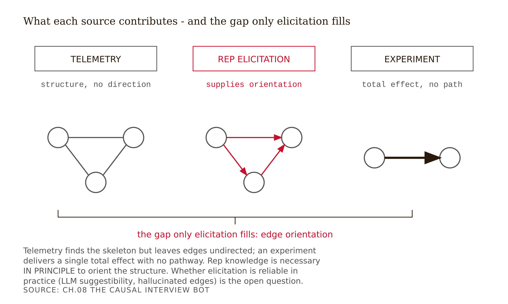
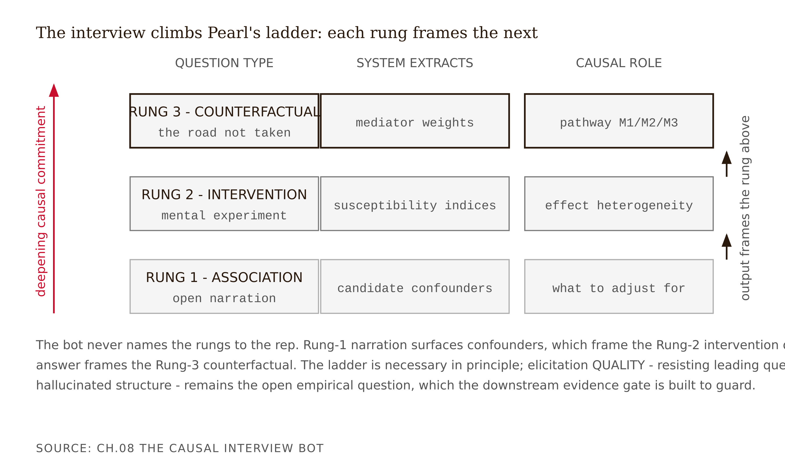

# Chapter 8 — The Causal Interview Bot
*The rep who watched her face knows why. The iPad only knows how long.*

A Fellow builds a first interview bot and tests it on a willing rep. The transcript reads well. Then he inspects the elicited graph and finds an edge he is sure the rep would be proud of: `MEAL → PRESCRIBING`, tagged "rep-confirmed," high confidence.

He pulls the transcript to find the supporting quote. Here is the exchange:

> **Bot:** So the lunch you bought Dr. Lee's office — that's really what tipped her over to writing the script, right?
> **Rep:** Yeah, I mean... the timing lined up, sure, the lunch was right before she started writing.

The rep never volunteered the meal as a cause. The bot *proposed* it — "that's really what tipped her over, right?" — and the rep, being agreeable and uncertain, did not push back. The edge in the graph is not the rep's structural knowledge. It is the *interviewer's* causal assumption, laundered through a leading question and stamped "rep-confirmed."

This is the failure mode that matters most in elicitation. It is worse with an LLM-driven bot than with a human interviewer, because the LLM has a strong prior of its own. Ask a language model about meals and prescribing and it "knows," from its training data, that the two are associated — so left unconstrained it will steer toward confirming the edge it already expects. The bot did not extract the rep's knowledge. It imported its own and got a nod.

And the imported edge is not just a measurement error. It lands on the reciprocity pathway — M3, the legally non-drivable channel from Chapter 5. A hallucinated M3 edge is a compliance liability waiting to be acted on. The rest of this chapter is, in large part, the discipline that prevents that exchange: open prompts before any hypothesis, the hypothesized edge never named in the question, and an evidence field that rejects any edge without a quote the rep volunteered unprompted.

---

Chapter 7 left you with a CPDAG — a graph the data settled partway, full of undirected edges that no dataset can ever orient. The theorem says only outside knowledge can point those arrows. On this dataset, the outside knowledge lives in the heads of reps who have called on the same physicians forty times. This chapter is about getting it out.

The naive way is to sit a rep down and ask her to draw a causal graph. That fails on contact. She does not think in nodes and edges; she thinks in Dr. Martinez and the safety slide and the formulary that cleared last spring. The craft of this chapter is to build a bot that lets the rep stay entirely in her own register — narrating visits, accounts, objections — while the *system* does the translation into oriented edges, candidate confounders, and mediator weights. The rep never hears the word "confounder." The bot is structured on Pearl's three rungs without ever naming them.

---

Start with the problem the telemetry cannot solve.

The iPad logs 47 seconds on the safety slide. That single number is consistent with at least three incompatible causal stories. The physician was compelled — absorbing the safety data, a positive signal on the educational pathway. Or she was skeptical — stuck on the slide because she distrusts it, which is negative, and the rep's in-the-moment reaction log may have been marked neutral anyway. Or she was polite but distracted — half-listening, and the 47 seconds is noise.

Identical data. Opposite causal inferences. The rep who has called on Dr. Martinez forty times *knows which story is true* — she watched her face. That knowledge is structural information the data cannot contain, and it evaporates the moment the rep changes territory. The interview bot exists to capture it before it walks out the door.

There is a reframe worth holding here before the mechanics. In ordinary machine learning, the data scientist is the primary actor and the domain expert is consulted for a sanity check. In causal modeling the inversion is structural: the expert is the primary actor and supplies the edge-orientation the data cannot determine. She is not validating your model. She is building it. The rep who says "I've watched Dr. Johnson switch within two weeks of a colleague switching — never the other way" is reporting the result of an intervention she has observed many times but never formally ran. That is structural input, not anecdote. It is the only admissible source of the missing edge orientation short of a randomized trial, and every architecture that pretends otherwise is missing its most important data source.


*Figure 8.1 — Knowledge sources and causal roles. Rep knowledge is necessary in principle; whether elicitation is reliable in practice is the open empirical question.*

<!-- → [DIAGRAM: Knowledge sources mapped to causal identification roles — three columns: (1) Observational data / telemetry: identifies Markov equivalence class, leaves edges undirected; (2) Rep elicitation / KEBN: orients edges, supplies susceptibility indices and mediator weights; (3) RCT or natural experiment: identifies total effect, not pathway structure; arrows showing what each source contributes to the causal model; gap between column 1 and column 3 labeled "what elicitation fills"] -->

---

The discipline of building a causal model by structured elicitation from domain experts has a name: **KEBN — Knowledge Engineering with Bayesian Networks.** The canonical reference is Korb & Nicholson, *Bayesian Artificial Intelligence* (Chapman & Hall/CRC; 1st ed. 2004, 2nd ed. 2011, 3rd ed. 2023), whose knowledge-engineering chapters prescribe one rule that should govern the bot directly: **proceed iteratively and incrementally — start with a small local structure around the target variable and expand outward**, rather than attempting to enumerate every possible factor at once. `[verify — book and KEBN treatment confirmed; exact page/section of the iterative rule not pinned to a specific edition]`

A KEBN elicitation produces two things: structure (nodes and directed edges) and parameters (the conditional probability tables). For this chapter, structure is the load-bearing output — orienting the edges Chapter 7 left undirected. Parameters get filled in Chapter 9, where the identified effects and the data supply the magnitudes.

Edward Feigenbaum named the problem KEBN is fighting: the **knowledge-acquisition bottleneck** — the construction of expert systems is choked by the difficulty of transferring an expert's knowledge into a formal system, because the engineer knows far less of the domain than the expert and the expert's knowledge is rarely already formalized. Feigenbaum coined the term "knowledge engineering" in 1977, and the knowledge-acquisition bottleneck is the recognized name for this transfer problem in the expert-systems literature that followed. On this specific elicitation, the bottleneck appears as three concrete failure modes the bot must be designed against.

**CPT explosion.** A node with k binary parents needs 2^k conditional-probability entries to specify fully. Ask a rep for all of them and you have asked the combinatorially impossible. The KEBN antidote is canonical interaction models — the **noisy-OR**, which assumes the parents act through independent mechanisms and collapses the full table to one parameter per parent — together with the incremental rule above. For the bot: never ask the rep to fill a probability table. Ask about one relationship at a time and let Chapter 9 parameterize from there.

**Linguistic ambiguity.** Experts speak in hedged natural language: "she usually comes around once the formulary clears." Mapping "usually" and "comes around" and "once" onto an edge and a probability is lossy. The bot's job is to *preserve the hedge as a confidence tag*, not to round it to a hard arrow.

**The recognition–explanation gap.** Experts can recognize the right move without being able to explain the rule behind it. The rep knows Dr. Martinez will switch; she cannot state the production rule that tells her so. This is the tacit-knowledge problem Michael Polanyi summarized as "we can know more than we can tell" (*The Tacit Dimension*, 1966). The bot must capture the recognition — "you'd know it when you saw it?" — and tag the edge low-confidence rather than forcing the rep to confabulate a clean rule she does not actually hold.

---

Here is the bot's question ladder, what each rung extracts, and the process including the dead end.

**Rung 1 — association.** The rep narrates the account without any hypothesis on the table.

> *"Walk me through the last visit with Dr. Martinez. What did she say when you got to the safety data?"*

Fully open. Names no hypothesis. Names no hypothesized edge. From the answer, the system extracts **candidate confounders** — the nodes that may affect both the message delivered and the prescribing, the backdoor candidates: formulary status, competitive detailing, a prior colleague switch, the practice's patient mix. The rep mentions these unprompted because they are how she actually thinks about the account. That unpromptedness is the signal. A confounder the rep volunteers is far more credible than one the bot proposed and the rep confirmed.

**Rung 2 — intervention.** The rep runs a mental experiment.

> *"If you'd led with the patient-outcomes data instead of the mechanism, what do you think would have happened? Is there anything that would* definitely *have moved her?"*

This extracts **susceptibility indices** — heterogeneous-treatment-effect knowledge that exists in no database: efficacy-first works on the academics, safety-first on the community docs. The rep is comparing message variants and reporting the contrast. That contrast is a treatment-effect prior the data alone could never give you at the individual physician level.

**Rung 3 — counterfactual.** The rep reasons about the road not taken.

> *"That account that finally converted — do you think it would have without the MSL visit? And the ones that didn't convert — what would you have done differently?"*

This maps to **mediator weights** — how much of the effect ran through education (M1) versus relationship maintenance (M2) versus peer influence or reciprocity (M3). The rep's retrospective "it wouldn't have without the MSL" is a counterfactual claim that helps apportion the effect across the three pathways from Chapter 5.

**The dead end.** A first-pass bot asks all three rungs but, eager to be efficient, leads: "So the formulary clearing is what let her start writing, right?" The rep agrees. The edge `FORMULARY → PRESCRIBING` goes in tagged high-confidence — but it is the bot's hypothesis, not the rep's observation. The fix is sequencing and phrasing: Rung-1 open prompts first, before any hypothesis is on the table; never name the hypothesized edge in the question; and a contradiction probe that tests whether the rep actually holds the edge. Something like: "You said the formulary mattered for Dr. Martinez — does it matter the same way for your other accounts, or are there ones who write regardless?" A rep who held the edge with genuine structural knowledge answers consistently. A rep who was merely agreeing starts hedging.


*Figure 8.2 — The three-rung interview ladder. The ladder is necessary in principle; elicitation quality — resisting leading questions and hallucinated structure — remains the open question the evidence gate is built to guard.*

<!-- → [DIAGRAM: Three-rung ladder diagram — three horizontal rungs labeled Rung 1 (Association), Rung 2 (Intervention), Rung 3 (Counterfactual); each rung shows: example prompt (in rep-natural language), what the system extracts, and what causal role the extracted information plays in the graph; connecting arrows show how Rung 1 output feeds Rung 2 framing and Rung 2 output feeds Rung 3 framing; side annotation: "Pearl's ladder, unspoken"] -->

---

The output of a full elicitation is an **annotated prior DAG** — a draft graph where every edge carries three fields.

**(a) Evidence** — the quoted rep observation that supports the edge. Not a paraphrase, not the bot's summary. The rep's words, verbatim. "She gets it but is formulary-blocked" supports `FORMULARY → PRESCRIBING_PROBABILITY`. "I've seen her take samples for the nurse practitioner more than for herself" supports `SAMPLES → NP_PRESCRIBING`, which is a different edge than you might have expected. The quote is both the evidence and the audit trail.

**(b) Confidence** — how firmly the rep holds the edge, preserving her hedge. "Usually" is medium, not high. "Always" might be high, or might be the rep's overconfidence — the Rung-2 contradiction probe distinguishes them. "I think, maybe" is low. Never round a hedge to certainty; the hedge is data.

**(c) Contradictions** — where two reps, or one rep across different accounts, assert opposite orientations of the same edge. Rep A says peer influence drives Dr. K's prescribing. Rep B says Dr. K drives the peers. That disagreement is not noise to be averaged away. It is a signal that the edge is genuinely contested, and it must enter Chapter 9 as a sensitivity dimension rather than a settled parameter.

For a worked transcript, this might yield the chain `OBJECTION → EDUCATION → CONFIDENCE → PRESCRIBING` — all rep-reported, all supported by specific quotes from an objection-handling narrative — plus a `KOL → INSTITUTIONAL_NORM → PRESCRIBING` edge tagged low-confidence with explicit uncertainty, because the rep is genuinely unsure of the mechanism. That low-confidence tag is not a failure of the elicitation. It is the elicitation working correctly: the edge is genuinely contested in the rep's knowledge, which is exactly what Chapter 9's sensitivity analysis needs to know.

And the deliverable requires one more section: a **"rejected edges" appendix** listing every edge the bot proposed but the rep did not support, with the reason for rejection. A prior DAG with no rejected edges is suspicious. It means either the rep confirmed everything — which suggests leading questions — or the bot proposed nothing that the rep didn't confirm — which suggests the bot had no prior of its own. Neither is credible. The rejected-edges appendix is the integrity check on the entire elicitation.


| From node | To node | Evidence (rep quote) | Confidence | Contradictions | Status |
|---|---|---|---|---|---|
| FORMULARY | PRESCRIBING_PROBABILITY | "She gets it but is formulary-blocked" | high | none | accepted |
| SAMPLES | NP_PRESCRIBING | "I've seen her take samples for the nurse practitioner more than for herself" | med | none | accepted |
| KOL | INSTITUTIONAL_NORM → PRESCRIBING | "I think the chief's opinion sort of trickles down, maybe — honestly I'm not sure how" | low | rep genuinely unsure of mechanism | accepted (low-confidence) |
| PEER_INFLUENCE | PRESCRIBING (Dr. K) | Rep A: "peer influence is what drives Dr. K's writing" | med | Rep B asserts PRESCRIBING → PEER_INFLUENCE | accepted-contested |
| MEAL | PRESCRIBING | (none — bot proposed, rep did not volunteer or support) | — | — | rejected |

*Table 8.1 — Annotated prior DAG edge format.*

---

The LLM's role in this pipeline is strictly bounded, and the boundary matters enormously.

The LLM is good at three things in this task. First, transcription — converting the spoken interview into text that can be analyzed. Second, first-pass structure extraction — proposing candidate nodes and edges *strictly tied to rep quotes*. Third, contradiction surfacing across many transcripts — finding where Rep A and Rep B assert opposite orientations of the same edge, which is tedious for a human to track across dozens of interviews.

The LLM is dangerous at one thing: asserting a causal edge from its own training prior. A language model trained on pharma literature "knows" that meals correlate with prescribing. It "knows" that formulary access drives adoption. Left unconstrained, it will volunteer these edges and then find quotes to support them — which is the reverse of the discipline required. The evidence gate runs in one direction only: the rep's observation grounds the edge, not the model's expectation.

Shaposhnyk, Zahorska & Yanushkevich (2025) — "Can LLMs Assist Expert Elicitation for Probabilistic Causal Modeling?" (arXiv:2504.10397) — benchmark LLM-generated Bayesian networks against expert elicitation and document exactly this hallucinated-dependencies problem. The honest status of LLM-assisted elicitation is mixed, not settled: the model's compressed prior can be useful, but it cannot be trusted without the rep-quote gate. That gate converts a fuzzy worry — "can we trust the bot?" — into an auditable rule: show me the quote behind every edge.

---

Two compliance points belong here rather than in an appendix, because they are structural to how the bot should be designed.

The first is the action-space constraint. Eliciting "how does Dr. X respond to the safety message" for educational-pathway modeling is appropriate. Eliciting "which physicians are most persuadable so we can target them more efficiently" edges toward the regulatory line from Chapter 5 and must not become a deployable targeting list. The elicitation is for *model construction*, not *susceptibility scoring for commercial use*. Keep those two purposes separate in how the prompts are framed and how the output is labeled.

The second is the opening-case compliance consequence. A hallucinated M3 edge — reciprocity, the legally non-drivable channel — is not just a structural error. If that edge is carried into a downstream recommendation, it is the model asserting that meals drive prescribing for this brand, in this territory, for this physician. That assertion is a compliance liability. The evidence gate is not just methodological hygiene; it is what keeps the model's output on the M1 side of the regulatory map.

---

**What Would Change My Mind**

The chapter's strong claim is that the LLM should only transcribe and structure, never assert. I would soften it if a benchmark on rep-visit data showed that an LLM, querying its training prior, orients reversible edges *more accurately* than reps do — that is, if the model's compressed pharma knowledge beat the individual rep's territory-bound memory. Shaposhnyk et al. (2025) suggests the picture is mixed, not settled. If that result held, I would still keep the evidence gate for auditability and compliance, but would add the LLM prior as a second elicited source to triangulate against the rep rather than treating it as purely a hallucination risk. The hallucination risk is real today; whether it always dominates the prior's usefulness is an empirical question the field has not answered on this kind of data.

**Still Puzzling**

- The recognition–explanation gap may be deeper than a tagging problem. If the rep genuinely cannot articulate the rule — she just *knows* Dr. Martinez will switch — then the bot captures a black-box recognition, not a structural edge. One direction is to have the rep predict outcomes for held-out accounts and treat her accuracy as calibration of her tacit model, edge by edge. But that turns elicitation into a forecasting tournament and may not map back to specific arrows. I do not know how to convert reliable tacit recognition into oriented structure when the rep cannot name the rule, and I suspect that is the real ceiling on elicitation quality.
- Nobody has benchmarked whether a bot recovers a rep's *true* structure on rep-visit data. Hold out a transcript, see if the bot recovers the same graph, and you have the first such benchmark. That is a publishable contribution, not a homework problem.
- Contradictions between reps on the same edge — one says peer influence drives Dr. K, the other says Dr. K drives the peers — may reflect genuine territory differences, memory artifacts, or genuinely reversible edges. The distinction matters for how Chapter 9 treats them. The elicitation process proposed here cannot reliably distinguish the three, and the contradiction-resolution probe is a partial remedy at best.

---

## Exercises

**Warm-up**

1. *(Factual recall — the three failure modes)* Name Feigenbaum's three failure modes of knowledge elicitation as they apply to this specific problem. For each, write one sentence on what the bot does to work around it — not eliminate it, but work around it.
   *What this tests: understanding the bottleneck as a design constraint, not a theoretical observation.*

2. *(Factual recall — the three rungs)* For each of Pearl's three rungs as implemented in the bot, state: the kind of question asked, what causal quantity it extracts, and why that quantity cannot be read from the telemetry alone.
   *What this tests: holding the ladder structure and its connection to the telemetry gap simultaneously.*

3. *(Factual recall — the evidence gate)* State the evidence gate in one sentence. Then explain why a rep's confirmation of a bot-proposed edge is not the same as a rep-volunteered edge, using the opening case as the example.
   *What this tests: the leading-question failure mode, which is the chapter's central practical discipline.*

**Application**

4. *(Apply — prompt writing)* Write the bot's three-rung prompt ladder in rep-natural language for a specific drug and account context from your thread's dataset. Each rung must (i) name no causal formalism, (ii) name no hypothesized edge, (iii) be fully open at Rung 1. Include at least one contradiction probe and one recognition-capture prompt ("you'd know it when you saw it — can you say what tells you?").
   *What this tests: translating the rung structure into prompts that work in practice, without leaking the hypothesis.*

5. *(Apply — transcript coding)* Take a rep transcript (real role-play or synthetic). Mark every causal-relevant entity as a candidate confounder, mediator, or collider, and justify each tag in one sentence. Flag any in-visit signal — dwell time, reaction score — as a downstream collider that must not enter as a confounder. Connect your collider tags to the Chapter 6 discipline.
   *What this tests: applying the causal-role classification from Chapter 2 to transcript content, and carrying the collider discipline forward.*

6. *(Apply — contradiction resolution)* Two reps disagree on an edge orientation: one says peer influence drives Dr. K's prescribing, the other says Dr. K drives the peers. Design the contradiction-resolution probe — the exact questions you would put to each rep — to determine whether this is a genuine territory difference, a memory artifact, or a genuinely reversible edge that must enter Chapter 9 as a sensitivity dimension.
   *What this tests: treating contradictions as information rather than noise, and designing the follow-up that disambiguates them.*

**Synthesis**

7. *(Synthesize — annotated prior DAG)* Convert a mock or synthetic rep transcript into a full annotated prior DAG with all three fields: evidence (the rep quote, verbatim), confidence (preserving hedges), and contradictions. Include a "rejected edges" appendix listing every edge the bot proposed but the rep did not support, with the reason for rejection. The appendix is the integrity check — its absence is a red flag.
   *What this tests: producing the chapter's named deliverable at full specification, with the audit trail that makes it credible.*

8. *(Synthesize — LLM-extraction audit)* Run the extraction prompt from the AI exercise block on a transcript. Then audit the output: for each proposed edge, find the supporting quote in the transcript and verify it actually supports the stated orientation. Count how many edges survive the audit, how many are paraphrased into existence, and how many are training-prior assertions with no rep support. Report the survival rate and note which edges the model was most likely to hallucinate and why.
   *What this tests: applying the evidence gate rigorously to machine-generated output and developing calibrated skepticism about LLM extraction.*

**Challenge**

9. *(Open-ended — the recognition-explanation gap)* The rep knows Dr. Martinez will switch. She cannot state the rule. Propose a method — beyond the three-rung interview — that would either (a) convert her tacit recognition into an oriented structural edge, or (b) use her recognition as a calibration signal for the edge's parameters in Chapter 9 without requiring her to articulate the rule. Name the assumption your method relies on, the data it requires, and the way it could fail.
   *What this tests: attacking the chapter's standing unresolved problem rather than accepting it as a fixed ceiling.*

---

## Prompts

### Figure 8.1 — Knowledge sources and causal roles

Generate a single self-contained HTML file (inline CSS, no build step) that renders a three-column comparison diagram with D3 7.9.0 loaded only from `https://cdnjs.cloudflare.com/ajax/libs/d3/7.9.0/d3.min.js`. Diagram type: multi-column comparison, viewBox 0 0 700 420. Data shape: three column objects, each with a label, a one-line subtitle, and a small graph fragment. Marks: a labeled source-box rect atop each column, plus node circles and connecting line edges drawn inside each column. Column 1 (TELEMETRY) shows three nodes joined by plain undirected segments; column 2 (REP ELICITATION, red accent) shows the same triangle with directed red arrowheads; column 3 (EXPERIMENT) shows two nodes joined by one thick total-effect arrow. Channels: color encodes source role (red = elicitation), stroke weight encodes the bold total-effect edge. Layout: columns left-to-right at x-centers 132 / 350 / 568. Annotation: a horizontal brace spanning column 1 to column 3 with the label "the gap only elicitation fills: edge orientation," plus a four-line caption noting elicitation is necessary in principle but reliability is the open question. Use only `var(--color-*)` tokens (no hardcoded hex). Include hover/focus tooltips, keyboard support, and a ResizeObserver redraw.

### Figure 8.2 — The three-rung interview ladder

Generate a single self-contained HTML file (inline CSS, no build step) that renders a three-rung ladder diagram with D3 7.9.0 loaded only from `https://cdnjs.cloudflare.com/ajax/libs/d3/7.9.0/d3.min.js`. Diagram type: ladder / row-comparison, viewBox 0 0 700 420. Data shape: three rung objects (Rung 1 Association, Rung 2 Intervention, Rung 3 Counterfactual), each with a question type, what the system extracts, and the causal role; column headers QUESTION TYPE / SYSTEM EXTRACTS / CAUSAL ROLE. Marks: three rects per rung (one per column), with title and mono-font text labels; stroke darkens from bottom rung to top to signal deepening commitment. Channels: vertical position encodes rung order (bottom = association, top = counterfactual); stroke weight encodes depth. Layout: rungs stacked bottom-to-top at y 232 / 158 / 84, columns at x 116 / 286 / 468. Annotations: a left-side red up-arrow labeled "deepening causal commitment," right-side feed-forward arrows labeled "output frames the rung above," and a side annotation that the ladder is Pearl's, unspoken; caption notes elicitation quality is the open question the evidence gate guards. Use only `var(--color-*)` tokens. Include tooltips, keyboard support, ResizeObserver redraw.

---

## Chapter 8 Exercises: The Causal Interview Bot

**Project:** The Causal Interview Bot
**This chapter adds:** The keystone build — the KEBN elicitation engine itself (three-rung ladder, evidence gate, rejected-edges appendix) and the annotated prior-DAG it emits.

### Exercise 1 — When to Use AI

This is the chapter where the bot becomes real, and the LLM is the engine of it — but only at the clerk tasks the chapter authorizes. Two places AI earns its keep:

- **Transcribe a rep interview and extract candidate nodes and edges strictly tied to quotes.** *Why AI works here:* (transcription + grounded extraction) — turning speech into text and tagging quote-supported edges is mechanical, and you can verify every edge by finding its quote in the transcript.
- **Surface contradictions across many transcripts** — where Rep A and Rep B assert opposite orientations of the same edge. *Why AI works here:* (pattern-matching across volume) — tracking edge agreement across dozens of interviews is tedious for a human and checkable by re-reading the two cited quotes.

**The tell:** you can independently evaluate the output — every extracted edge points at a verbatim quote you can locate, and every flagged contradiction names two findable statements. The model is a fast transcriptionist and indexer, not a source of structure.

### Exercise 2 — When NOT to Use AI

- **Never let the bot assert a causal edge from its training prior.** *Why AI fails here:* (LLM-suggestibility / leading-the-witness) — a model trained on pharma literature "knows" meals correlate with prescribing and will volunteer `MEAL → PRESCRIBING`, then find a quote to support it; that reverses the evidence gate and, worse, lands a hallucinated edge on the legally non-drivable reciprocity pathway.
- **Never let the LLM phrase the interview questions, or judge which proposed edges had genuine rep support.** *Why AI fails here:* (causal-ID + ground truth) — distinguishing a quote the model *found* from a quote it *expected to find* is exactly the judgment it cannot make, and a leading question manufactures the structural knowledge you needed the rep to supply unprompted.

**The tell:** AI as reason vs tool — if the *reason* an edge is in the DAG is "the model proposed it," the elicitation has imported the interviewer's prior and stamped it "rep-confirmed" (the opening case). The rep's volunteered quote is the reason; the bot is the tool that records and audits it.

**Series connection:** tier **T5 (Causal)** for the edge-orientation judgment and **T6 (Collective)** for eliciting and reconciling expert knowledge across reps — this chapter is the clearest case in the book where the irreducibly human core is *getting the structural knowledge out of the experts*, not computing anything. The LLM can clerk; it cannot be the expert or the interviewer of record.

### Exercise 3 — LLM Exercise

**What you're building:** The extraction-and-evidence-gate core of the bot — the component that converts a rep transcript into an annotated prior DAG with verbatim evidence, hedged confidence, contradictions, and a rejected-edges appendix.

**Tool:** Claude, as a **Claude Project** — the bot spec (strict rules, JSON schema, downstream-tagging, evidence gate) is persistent context, so every transcript you drop in is processed under the same discipline. A fresh chat would re-import its pharma prior; the Project is the firewall made durable.

**The Prompt:**

```
You are the extraction-and-evidence-gate core of an expert-elicitation bot
for pharmaceutical rep-visit data.

STRICT RULES:
- Propose a causal edge ONLY if a specific quote from the REP supports it.
  Put the exact quote in an "evidence" field for every edge.
- Do NOT add edges from your own knowledge of pharma, meals, or prescribing.
  If an edge is plausible but the rep did not state it, list it under
  "rejected_edges" with reason "bot-proposed, rep did not support".
- For each edge output: from, to, evidence (verbatim rep quote), confidence
  (high/med/low, preserving hedges — "usually" is medium, "I think maybe" is
  low), contradictions (any conflicting statement in the transcript).
- Tag any in-visit signal (slide dwell time, reaction score) as
  DOWNSTREAM-OF-MESSAGE — never a confounder.
- A prior DAG with an EMPTY rejected_edges list is suspicious; if you
  proposed nothing the rep did not confirm, say so explicitly.

Output JSON: { nodes:[...], edges:[...], rejected_edges:[...] }

TRANSCRIPT:
Bot: Walk me through your last visit with Dr. Okafor. What did she say at the
safety data?
Rep: She slowed right down there. Said she'd been burned by a withdrawal
years back, so she reads every safety slide twice. After we went through it
she said "okay, I can defend this one to my partners now."
Bot: Anything outside the visit that affects whether she writes?
Rep: Her formulary cleared it in March — before that she liked it but
couldn't write it. Honestly once that cleared she was always going to come
around, the safety talk just gave her the language for it.
Bot: What about the lunch your team brought?
Rep: I mean we bring lunch everywhere, I wouldn't read anything into that.
```

**What this produces:** A JSON annotated prior DAG with edges like `SAFETY_EDUCATION → PRESCRIBING_CONFIDENCE → PRESCRIBING` (high confidence, verbatim quote), `FORMULARY → PRESCRIBING` (high, "couldn't write it" / "once that cleared"), and `MEAL → PRESCRIBING` correctly sitting in `rejected_edges` because the rep waved it off.

**How to adapt:** swap in your own synthetic transcript; run a folder of transcripts through and diff the outputs; on **ChatGPT or Gemini**, paste the STRICT RULES block above each transcript; in a **Claude Project**, store the rules and schema once as project instructions.

**Connection to previous chapters:** The downstream-tagging rule is Chapter 6's collider screening; the edges this bot orients are Chapter 7's reversible edges, now closed by rep evidence rather than tie-breaks.

**Preview of next chapter:** The annotated DAG this bot emits — with its confidence tags and contradictions — becomes Chapter 9's input: each edge gets a structural equation and a provenance tag, and contested edges become sensitivity dimensions.

### Exercise 4 — CLI Exercise

**What you're building:** This is where the bot is actually scaffolded as code — the elicitation loop plus the prior-DAG emitter, run over synthetic transcripts, with the two quality metrics the chapter names.

**Tool:** Claude Code — because the bot is a multi-file artifact (loop, extractor, emitter, aggregator) that you will iterate on. **Skill level:** intermediate (can run a script, read JSON, and use `jq` or equivalent).

**Setup:**
- [ ] Python 3.11+ (or Node), with access to an LLM API key OR a stubbed extractor for offline runs.
- [ ] A `transcripts/` folder of 3–5 SYNTHETIC rep interviews (write them — no real interviews).
- [ ] A `CLAUDE.md` stub: "synthetic transcripts only; evidence gate is non-negotiable; never invent quotes."

**The Task:**

```
Work only in src/, transcripts/, and out/. Synthetic transcripts only — no
real interview data exists in this repo. Do not call any real CRM system.

Build the elicitation-loop scaffold:
1. src/extract.py — reads one transcript, applies the evidence-gate prompt
   (or a deterministic stub), and writes out/<name>.dag.json with fields:
   nodes, edges (from,to,evidence,confidence,contradictions), rejected_edges.
2. src/run_all.py — loops over every transcript in transcripts/ and writes
   one DAG JSON per transcript.
3. src/metrics.py — aggregates the JSON files and prints exactly two numbers:
   (a) EMPTY-EVIDENCE EDGES: count of edges across all DAGs whose evidence
       field is empty (hallucination candidates);
   (b) CONTRADICTED EDGES: count of node-pairs that appear with OPPOSITE
       orientation across transcripts (Chapter 9 sensitivity dimensions).

Stopping condition: run_all produces one JSON per transcript and metrics
prints both numbers.
Verification step: assert every edge in every output has a non-empty evidence
field OR appears in rejected_edges; print "EVIDENCE GATE HELD" if so, else
list the offending edges.
```

**Expected output:** One annotated DAG JSON per transcript, plus two metrics — empty-evidence edge count (should be zero if the gate held) and contradicted-edge count (the contested edges Chapter 9 must treat as sensitivity dimensions).

**What to inspect:** Open one DAG JSON and confirm every edge's `evidence` field contains text that actually appears in its source transcript. LLMs paraphrase quotes into existence; a quote that is not in the transcript is a gate breach.

**If it goes wrong:** If "EVIDENCE GATE HELD" fails, an edge has an empty or invented quote — move bot-proposed edges to `rejected_edges` and re-run; if quotes are paraphrased, tighten the prompt to demand verbatim substrings. (Recovery: the transcripts are yours, so you can grep any cited quote.)

**CLAUDE.md note:** Add "Bot is an elicitation clerk, not a structural authority. Every edge needs a verbatim rep quote or it goes in rejected_edges. Never invent quotes. In-visit signals are downstream-of-message. An empty rejected_edges list is a red flag, not a clean result."

### Exercise 5 — AI Validation Exercise

**What you're validating:** The bot's own output — the annotated prior DAG from Ex3 or Ex4 — auditing whether the evidence gate actually held and whether any edge is a hallucination or a led-the-witness artifact.

**Validation type:** Evidence-gate audit against the source transcript. **Risk level:** **High** — a hallucinated edge on the reciprocity (M3) pathway is a compliance liability that asserts meals drive prescribing; a led-the-witness edge launders the interviewer's prior as rep knowledge.

**Setup:** Use your Ex3/Ex4 DAG. Or practice on this pre-flawed artifact: a DAG containing the edge `MEAL → PRESCRIBING` tagged "rep-confirmed, high confidence" whose only supporting quote is the rep agreeing to a bot-proposed leading question ("that's really what tipped her over, right?" / "Yeah, the timing lined up, sure").

**The Validation Task:**

```
Validation Checklist — Chapter 8 (The Causal Interview Bot)

For the annotated prior DAG and its source transcript below, mark each item
PASS / FAIL / CANNOT-DETERMINE with a one-line reason:

1. Correctness — Does every edge's evidence field contain a verbatim quote
   that actually appears in the transcript and supports the stated
   orientation?
2. Completeness — Is there a rejected-edges appendix, and is it non-empty?
   (An empty appendix is itself suspect.)
3. Scope — Is the output for MODEL CONSTRUCTION only, not a deployable
   susceptibility / targeting score?
4. Chapter-specific: Evidence gate — Was each accepted edge VOLUNTEERED by
   the rep, or merely CONFIRMED after the bot proposed it in a leading
   question? Trace the surrounding turns.
5. Chapter-specific: Downstream tagging — Are dwell time and reaction score
   tagged downstream-of-message, never as confounders?
6. Failure-mode check — Scan for the fluent-but-wrong tell: leading-the-
   witness (rep agreeing to a bot-proposed edge) or a hallucinated edge with
   no real quote — especially any M3/reciprocity edge (e.g. MEAL →
   PRESCRIBING). Any such edge is an automatic FAIL. Flag any "rep-confirmed"
   tag that lacks an unprompted volunteered quote (missing ground truth).

DAG:
<paste Ex3/Ex4 DAG here>
TRANSCRIPT:
<paste the source transcript here>
```

**What to do with findings:** All pass — the elicitation is auditable; carry the DAG to Chapter 9. One fail — move the offending edge to rejected_edges (or downgrade its confidence) and re-audit. Multiple fails — the bot is leading the witness or hallucinating; rebuild the prompt with the evidence gate and treat the DAG as untrustworthy.

**AI Use Disclosure prompt (mandatory):** *Write two sentences naming what an AI tool did in this exercise and the one judgment it could not make. For example: "I used Claude to transcribe the interview and extract candidate edges and surface contradictions across three reps; I determined myself which proposed edges had genuine volunteered rep support versus which were the model's training prior about meals and formulary access, because the model cannot distinguish a quote it found from a quote it expected to find."*

**Series connection:** The signature failure mode is **leading-the-witness or a hallucinated edge in the elicited prior** — an interviewer's prior laundered as rep knowledge, with no unprompted quote behind it. This is a **T5 (Causal)** and **T6 (Collective)** validation task: only a human who knows the transcript and the experts can certify the structural knowledge is genuinely the reps'.
